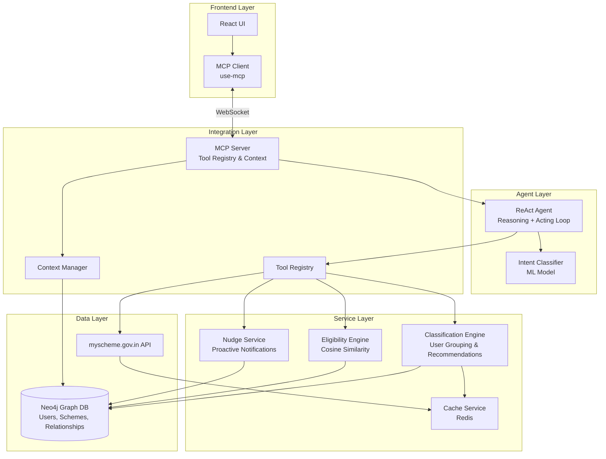
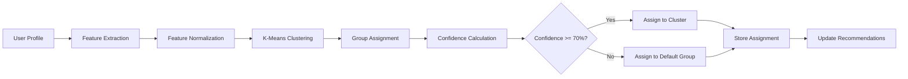
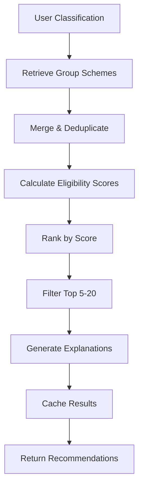
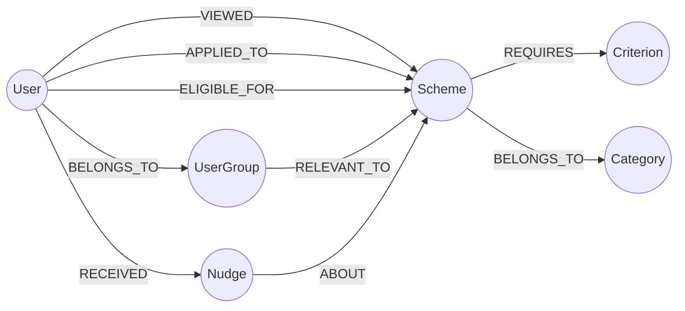

# Design Document: Personalized Scheme Recommendation System

## Overview

The Personalized Scheme Recommendation System is an AI-powered platform that connects citizens with relevant government schemes through conversational AI. The system combines ReAct (Reasoning + Acting) agents, Model Context Protocol (MCP) integration, and machine learning-based classification to deliver personalized recommendations from myscheme.gov.in.

### Key Design Principles

1. **Conversational-First**: Natural language interaction through ReAct agents for intuitive user experience
2. **Personalization**: ML-based user classification and cosine similarity matching for relevant recommendations
3. **Modularity**: MCP Server as a universal adapter layer for external integrations
4. **Progressive Enhancement**: Anonymous users get immediate value; registered users get personalization
5. **Resilience**: Graceful degradation with caching, fallbacks, and circuit breakers
6. **Privacy-First**: Encryption at rest and in transit, user data control, audit logging

### System Context

The system serves two primary user types:
- **Anonymous Users**: First-time visitors exploring general scheme information
- **Registered Users**: Users with profiles receiving personalized recommendations and proactive nudges

The platform integrates with myscheme.gov.in API to fetch real-time government scheme data and uses Neo4j graph database to model complex relationships between users, schemes, and eligibility criteria.

## Architecture

### High-Level Architecture




### Architecture Layers

#### 1. Frontend Layer
- **React UI**: User interface components for conversation, scheme browsing, and profile management
- **MCP Client**: WebSocket-based client using `use-mcp` library for real-time communication with MCP Server

#### 2. Agent Layer
- **ReAct Agent**: Implements reasoning and acting loops to process user queries, maintain conversation context, and orchestrate tool execution
- **Intent Classifier**: ML model that analyzes natural language queries to determine user intent and route to appropriate tools

#### 3. Integration Layer
- **MCP Server**: Universal adapter providing standardized tool interface, context wiring, and session management
- **Tool Registry**: Catalog of available tools (scheme search, eligibility check, profile update, etc.)
- **Context Manager**: Maintains conversation state and user context across tool invocations

#### 4. Service Layer
- **Classification Engine**: ML pipeline for user grouping and scheme recommendation generation
- **Eligibility Engine**: Calculates cosine similarity scores between user profiles and scheme requirements
- **Nudge Service**: Proactive notification system for new schemes and deadline reminders
- **Cache Service**: Redis-based caching for scheme data and computed recommendations

#### 5. Data Layer
- **Neo4j Graph Database**: Stores users, schemes, relationships, and eligibility criteria as graph structures
- **myscheme.gov.in API**: External government API providing scheme data

### Communication Patterns

1. **Synchronous Request-Response**: Frontend ↔ MCP Server ↔ Services
2. **Asynchronous Events**: Nudge Service triggers based on scheme updates
3. **Streaming**: ReAct Agent streams reasoning steps to frontend for transparency
4. **Caching**: Multi-level caching (Redis for schemes, in-memory for sessions)


## Components and Interfaces

### 1. ReAct Agent

The ReAct Agent implements a reasoning and acting loop to process user queries through iterative thought-action-observation cycles.

#### Component Structure

```typescript
interface ReActAgent {
  // Core reasoning loop
  processQuery(query: string, context: ConversationContext): Promise<AgentResponse>
  
  // Thought generation
  generateThought(query: string, history: Message[]): Promise<Thought>
  
  // Action selection
  selectAction(thought: Thought, availableTools: Tool[]): Promise<Action>
  
  // Observation processing
  processObservation(actionResult: ToolResult): Promise<Observation>
  
  // Response generation
  generateResponse(observations: Observation[]): Promise<AgentResponse>
}

interface ConversationContext {
  sessionId: string
  userId?: string
  userProfile?: UserProfile
  messageHistory: Message[]
  toolExecutionHistory: ToolExecution[]
}

interface Thought {
  reasoning: string
  confidence: number
  requiredInformation: string[]
}

interface Action {
  toolName: string
  parameters: Record<string, any>
  reasoning: string
}

interface Observation {
  toolResult: ToolResult
  interpretation: string
  nextSteps: string[]
}
```

#### Reasoning Loop Algorithm

```
1. Receive user query and conversation context
2. THOUGHT: Analyze query and context to understand user intent
3. ACTION: Select appropriate tool(s) from MCP Server
4. OBSERVATION: Execute tool and interpret results
5. DECISION: 
   - If sufficient information gathered → Generate response
   - If more information needed → Return to step 2
   - If clarification needed → Ask user question
6. Generate final response with citations and next steps
```

#### Key Responsibilities

- Maintain conversation context across multiple turns
- Select appropriate tools based on intent and context
- Handle multi-step reasoning for complex queries
- Provide transparent reasoning to users
- Gracefully handle tool failures and ambiguous queries

### 2. Intent Classifier

ML model that classifies user queries into actionable intents.

#### Component Structure

```typescript
interface IntentClassifier {
  classify(query: string, context?: ConversationContext): Promise<IntentResult>
  train(trainingData: IntentTrainingData[]): Promise<ModelMetrics>
  evaluate(testData: IntentTrainingData[]): Promise<EvaluationMetrics>
}

interface IntentResult {
  primaryIntent: Intent
  secondaryIntents: Intent[]
  confidence: number
  entities: Entity[]
}

enum Intent {
  SCHEME_SEARCH = 'scheme_search',
  ELIGIBILITY_CHECK = 'eligibility_check',
  APPLICATION_INFO = 'application_info',
  DEADLINE_QUERY = 'deadline_query',
  PROFILE_UPDATE = 'profile_update',
  GENERAL_QUESTION = 'general_question',
  NUDGE_PREFERENCES = 'nudge_preferences'
}

interface Entity {
  type: 'location' | 'income' | 'occupation' | 'age' | 'scheme_name'
  value: string
  confidence: number
}
```

#### Model Architecture

- **Base Model**: Fine-tuned BERT or DistilBERT for intent classification
- **Input**: User query text + optional conversation context
- **Output**: Intent probabilities + extracted entities
- **Training**: Supervised learning on labeled query-intent pairs
- **Accuracy Target**: ≥85% on test set

#### Intent Categories

1. **scheme_search**: User looking for schemes matching criteria
2. **eligibility_check**: User wants to know if they qualify for a scheme
3. **application_info**: User needs application process details
4. **deadline_query**: User asking about scheme deadlines
5. **profile_update**: User wants to modify their profile
6. **general_question**: General inquiry about schemes or platform
7. **nudge_preferences**: User configuring notification settings

### 3. MCP Server

Universal adapter providing standardized tool interface and context management.

#### Component Structure

```typescript
interface MCPServer {
  // Tool management
  registerTool(tool: Tool): void
  getTool(toolName: string): Tool | undefined
  listTools(): Tool[]
  
  // Tool execution
  executeTool(toolName: string, params: any, context: ExecutionContext): Promise<ToolResult>
  
  // Context management
  createSession(userId?: string): Session
  getSession(sessionId: string): Session | undefined
  updateContext(sessionId: string, context: Partial<ExecutionContext>): void
  
  // Connection management
  handleConnection(client: WebSocket): void
  broadcast(message: ServerMessage): void
}

interface Tool {
  name: string
  description: string
  parameters: ParameterSchema
  execute(params: any, context: ExecutionContext): Promise<ToolResult>
  requiresAuth: boolean
  rateLimit?: RateLimit
}

interface ExecutionContext {
  sessionId: string
  userId?: string
  userProfile?: UserProfile
  conversationHistory: Message[]
  previousToolResults: ToolResult[]
}

interface ToolResult {
  success: boolean
  data?: any
  error?: ErrorInfo
  metadata: {
    executionTime: number
    cacheHit: boolean
    toolVersion: string
  }
}
```

#### Registered Tools

1. **search_schemes**: Search schemes by keywords, category, or criteria
2. **get_scheme_details**: Fetch complete details for a specific scheme
3. **check_eligibility**: Calculate eligibility score for user-scheme pair
4. **get_recommendations**: Generate personalized scheme recommendations
5. **update_profile**: Update user profile information
6. **get_application_info**: Retrieve application process details
7. **check_deadlines**: Get upcoming deadlines for schemes
8. **configure_nudges**: Update user nudge preferences

#### Context Wiring

The MCP Server automatically wires context between tool calls:
- User profile data flows to tools requiring personalization
- Previous tool results inform subsequent tool selection
- Conversation history provides context for ambiguous queries
- Session state persists across WebSocket reconnections


### 4. Classification Engine

ML pipeline for user grouping and scheme recommendation generation.

#### Component Structure

```typescript
interface ClassificationEngine {
  // User classification
  classifyUser(profile: UserProfile): Promise<UserGroupAssignment>
  
  // Recommendation generation
  generateRecommendations(userId: string): Promise<SchemeRecommendation[]>
  
  // Model training
  trainClassifier(trainingData: ClassificationTrainingData[]): Promise<ModelMetrics>
  
  // Batch processing
  reclassifyAllUsers(): Promise<BatchResult>
}

interface UserGroupAssignment {
  userId: string
  groups: UserGroup[]
  confidence: number
  features: FeatureVector
  timestamp: Date
}

interface UserGroup {
  groupId: string
  groupName: string
  description: string
  memberCount: number
  typicalSchemes: string[]
}

interface SchemeRecommendation {
  schemeId: string
  schemeName: string
  relevanceScore: number
  matchingCriteria: string[]
  explanation: string
  eligibilityScore: number
}

interface FeatureVector {
  demographic: {
    age: number
    gender: string
    maritalStatus: string
    familySize: number
  }
  economic: {
    incomeLevel: number
    employmentStatus: string
    occupation: string
  }
  geographic: {
    state: string
    district: string
    ruralUrban: string
  }
  categorical: {
    educationLevel: string
    caste: string
    disability: boolean
  }
}
```

#### Classification Algorithm

```
1. Feature Extraction:
   - Extract demographic, economic, geographic, and categorical features
   - Normalize numerical features (age, income)
   - One-hot encode categorical features
   - Create feature vector of dimension ~50

2. User Grouping:
   - Apply K-Means clustering (K=20-30 groups)
   - Assign user to nearest cluster(s)
   - Calculate confidence based on distance to cluster centroid
   - If confidence < 70%, assign to default broad category

3. Scheme Matching:
   - For each user group, maintain pre-computed scheme relevance scores
   - Retrieve top schemes for user's assigned groups
   - Merge and deduplicate schemes across groups
   - Rank by relevance score

4. Personalization:
   - Calculate individual eligibility scores using cosine similarity
   - Re-rank schemes by eligibility score
   - Filter to top 5-20 recommendations
   - Generate explanations for each recommendation
```

#### Performance Optimization

- Pre-compute group-scheme mappings (updated daily)
- Cache user classifications (invalidate on profile update)
- Batch process new users during off-peak hours
- Use approximate nearest neighbor for large user bases

### 5. Eligibility Engine

Calculates cosine similarity between user profiles and scheme requirements.

#### Component Structure

```typescript
interface EligibilityEngine {
  calculateEligibility(userId: string, schemeId: string): Promise<EligibilityResult>
  
  batchCalculateEligibility(userId: string, schemeIds: string[]): Promise<EligibilityResult[]>
  
  explainEligibility(result: EligibilityResult): Promise<EligibilityExplanation>
}

interface EligibilityResult {
  userId: string
  schemeId: string
  score: number // 0.0 to 1.0
  percentage: number // 0 to 100
  category: 'highly_eligible' | 'potentially_eligible' | 'low_eligibility'
  metCriteria: Criterion[]
  unmetCriteria: Criterion[]
  timestamp: Date
}

interface Criterion {
  name: string
  required: boolean
  userValue: any
  schemeRequirement: any
  matches: boolean
}

interface EligibilityExplanation {
  summary: string
  strengths: string[]
  gaps: string[]
  recommendations: string[]
}
```

#### Cosine Similarity Calculation

```
1. Vectorization:
   User Vector (U):
   - Age: normalized value
   - Income: normalized value
   - Location: one-hot encoded
   - Occupation: one-hot encoded
   - Other demographics: one-hot encoded
   
   Scheme Vector (S):
   - Age requirement: normalized range (min, max)
   - Income requirement: normalized range
   - Location eligibility: one-hot encoded
   - Occupation eligibility: one-hot encoded
   - Other requirements: one-hot encoded

2. Similarity Calculation:
   cosine_similarity = (U · S) / (||U|| × ||S||)
   
   Where:
   - U · S is the dot product
   - ||U|| and ||S|| are vector magnitudes

3. Scoring:
   - Raw score: 0.0 to 1.0
   - Percentage: score × 100
   - Category:
     * ≥0.8: highly_eligible
     * 0.5-0.8: potentially_eligible
     * <0.5: low_eligibility

4. Explanation Generation:
   - Compare each dimension of U and S
   - Identify matching criteria (high contribution to dot product)
   - Identify mismatches (zero or low contribution)
   - Generate natural language explanation
```

#### Optimization Strategies

- Pre-compute scheme vectors (static, cached indefinitely)
- Batch calculate eligibility for multiple schemes
- Use sparse vectors for categorical features
- Cache eligibility results for 24 hours

### 6. Nudge Service

Proactive notification system for new schemes and deadline reminders.

#### Component Structure

```typescript
interface NudgeService {
  // Scheme evaluation
  evaluateNewScheme(schemeId: string): Promise<NudgeCandidate[]>
  
  // Deadline monitoring
  checkUpcomingDeadlines(): Promise<DeadlineNudge[]>
  
  // Nudge delivery
  sendNudge(nudge: Nudge): Promise<DeliveryResult>
  
  // User preferences
  updatePreferences(userId: string, prefs: NudgePreferences): Promise<void>
}

interface NudgeCandidate {
  userId: string
  schemeId: string
  eligibilityScore: number
  reason: string
  priority: number
}

interface Nudge {
  nudgeId: string
  userId: string
  type: 'new_scheme' | 'deadline_reminder' | 'profile_update_suggestion'
  schemeId?: string
  title: string
  message: string
  actionUrl: string
  priority: number
  expiresAt: Date
}

interface NudgePreferences {
  enabled: boolean
  maxPerWeek: number
  channels: ('email' | 'sms' | 'push' | 'in_app')[]
  minEligibilityScore: number
  categories: string[]
}

interface DeliveryResult {
  nudgeId: string
  delivered: boolean
  channel: string
  timestamp: Date
  error?: string
}
```

#### Nudge Generation Algorithm

```
1. New Scheme Detection:
   - Poll myscheme API every 6 hours for new schemes
   - Compare with existing schemes in database
   - Identify truly new schemes (not just updates)

2. User Matching:
   - For each new scheme, calculate eligibility for all registered users
   - Filter users with eligibility score ≥ 70%
   - Check user nudge preferences (enabled, categories, min score)
   - Respect rate limits (max 3 per week per user)

3. Prioritization:
   - High priority: eligibility ≥ 90%, deadline within 30 days
   - Medium priority: eligibility 80-90%
   - Low priority: eligibility 70-80%

4. Deadline Reminders:
   - Query schemes with deadlines in next 7 days
   - Find users who viewed scheme but haven't applied
   - Send reminder nudge 7 days before deadline

5. Delivery:
   - Queue nudges in priority order
   - Deliver via user's preferred channels
   - Track delivery status and user engagement
   - Implement exponential backoff for failed deliveries
```

#### Rate Limiting

- Maximum 3 nudges per user per week
- Minimum 24 hours between nudges to same user
- Respect user's configured preferences
- Allow users to snooze or dismiss nudges


## Data Models

### User Profile

```typescript
interface UserProfile {
  userId: string
  
  // Authentication
  email: string
  passwordHash: string
  emailVerified: boolean
  
  // Demographics
  firstName: string
  lastName: string
  dateOfBirth: Date
  age: number
  gender: 'male' | 'female' | 'other' | 'prefer_not_to_say'
  maritalStatus: 'single' | 'married' | 'divorced' | 'widowed'
  familySize: number
  
  // Economic
  annualIncome: number
  incomeLevel: 'below_poverty' | 'low' | 'middle' | 'high'
  employmentStatus: 'employed' | 'self_employed' | 'unemployed' | 'student' | 'retired'
  occupation: string
  occupationCategory: string
  
  // Geographic
  state: string
  district: string
  pincode: string
  ruralUrban: 'rural' | 'urban' | 'semi_urban'
  
  // Categorical
  educationLevel: 'no_formal' | 'primary' | 'secondary' | 'higher_secondary' | 'graduate' | 'postgraduate'
  caste: 'general' | 'obc' | 'sc' | 'st' | 'other'
  religion?: string
  disability: boolean
  disabilityType?: string
  
  // System
  userGroups: string[]
  createdAt: Date
  updatedAt: Date
  lastLoginAt: Date
  profileCompleteness: number // 0-100
}
```

### Scheme

```typescript
interface Scheme {
  schemeId: string
  
  // Basic Information
  schemeName: string
  shortDescription: string
  fullDescription: string
  category: string
  subCategory: string
  sponsoredBy: string // Ministry/Department
  
  // Eligibility Criteria
  eligibility: {
    ageMin?: number
    ageMax?: number
    gender?: string[]
    incomeMax?: number
    states?: string[]
    districts?: string[]
    ruralUrban?: string[]
    occupations?: string[]
    educationLevels?: string[]
    castes?: string[]
    disability?: boolean
    otherCriteria?: Record<string, any>
  }
  
  // Benefits
  benefits: {
    type: 'financial' | 'subsidy' | 'training' | 'healthcare' | 'education' | 'other'
    amount?: number
    description: string
    duration?: string
  }[]
  
  // Application
  applicationProcess: {
    steps: string[]
    requiredDocuments: string[]
    applicationUrl: string
    helplineNumber?: string
    processingTime?: string
  }
  
  // Timeline
  launchDate: Date
  applicationDeadline?: Date
  isActive: boolean
  
  // Metadata
  sourceUrl: string
  lastUpdated: Date
  viewCount: number
  applicationCount: number
  
  // Computed
  eligibilityVector: number[] // Pre-computed for cosine similarity
}
```

### User Group

```typescript
interface UserGroup {
  groupId: string
  groupName: string
  description: string
  
  // Cluster characteristics
  centroid: FeatureVector
  radius: number
  memberCount: number
  
  // Typical member profile
  typicalProfile: {
    ageRange: [number, number]
    incomeRange: [number, number]
    commonOccupations: string[]
    commonLocations: string[]
    commonDemographics: Record<string, any>
  }
  
  // Associated schemes
  relevantSchemes: {
    schemeId: string
    relevanceScore: number
  }[]
  
  // Metadata
  createdAt: Date
  lastUpdated: Date
}
```

### Eligibility Score

```typescript
interface EligibilityScore {
  scoreId: string
  userId: string
  schemeId: string
  
  // Score
  rawScore: number // 0.0 to 1.0
  percentage: number // 0 to 100
  category: 'highly_eligible' | 'potentially_eligible' | 'low_eligibility'
  
  // Breakdown
  metCriteria: {
    criterionName: string
    weight: number
    contribution: number
  }[]
  
  unmetCriteria: {
    criterionName: string
    required: boolean
    userValue: any
    requiredValue: any
    gap: string
  }[]
  
  // Metadata
  calculatedAt: Date
  expiresAt: Date
  version: string
}
```

### Nudge

```typescript
interface Nudge {
  nudgeId: string
  userId: string
  
  // Content
  type: 'new_scheme' | 'deadline_reminder' | 'profile_update_suggestion'
  schemeId?: string
  title: string
  message: string
  actionUrl: string
  
  // Prioritization
  priority: 'high' | 'medium' | 'low'
  eligibilityScore?: number
  
  // Delivery
  channels: ('email' | 'sms' | 'push' | 'in_app')[]
  deliveryStatus: {
    channel: string
    delivered: boolean
    deliveredAt?: Date
    error?: string
  }[]
  
  // User interaction
  viewed: boolean
  viewedAt?: Date
  clicked: boolean
  clickedAt?: Date
  dismissed: boolean
  dismissedAt?: Date
  
  // Lifecycle
  createdAt: Date
  expiresAt: Date
}
```

### Conversation Session

```typescript
interface ConversationSession {
  sessionId: string
  userId?: string
  
  // Messages
  messages: {
    messageId: string
    role: 'user' | 'agent' | 'system'
    content: string
    timestamp: Date
    metadata?: Record<string, any>
  }[]
  
  // Tool executions
  toolExecutions: {
    executionId: string
    toolName: string
    parameters: Record<string, any>
    result: ToolResult
    timestamp: Date
  }[]
  
  // Context
  currentIntent?: Intent
  extractedEntities: Entity[]
  userProfile?: UserProfile
  
  // Lifecycle
  createdAt: Date
  lastActivityAt: Date
  expiresAt: Date
  isActive: boolean
}
```


## API Design

### REST API Endpoints

#### Authentication & User Management

```
POST /api/auth/register
Request:
{
  "email": "string",
  "password": "string",
  "profile": {
    "firstName": "string",
    "lastName": "string",
    "dateOfBirth": "date",
    "gender": "string",
    "maritalStatus": "string",
    "familySize": "number",
    "annualIncome": "number",
    "employmentStatus": "string",
    "occupation": "string",
    "state": "string",
    "district": "string",
    "pincode": "string",
    "educationLevel": "string",
    "caste": "string",
    "disability": "boolean"
  }
}
Response: 201 Created
{
  "userId": "string",
  "token": "string",
  "profile": UserProfile,
  "message": "Registration successful. Analyzing your profile..."
}

POST /api/auth/login
Request: { "email": "string", "password": "string" }
Response: 200 OK
{
  "userId": "string",
  "token": "string",
  "profile": UserProfile
}

GET /api/users/:userId/profile
Headers: Authorization: Bearer <token>
Response: 200 OK
{ "profile": UserProfile }

PUT /api/users/:userId/profile
Headers: Authorization: Bearer <token>
Request: { "profile": Partial<UserProfile> }
Response: 200 OK
{
  "profile": UserProfile,
  "message": "Profile updated. Recalculating recommendations..."
}

DELETE /api/users/:userId
Headers: Authorization: Bearer <token>
Response: 204 No Content
```

#### Scheme Discovery

```
GET /api/schemes
Query Parameters:
  - category: string (optional)
  - state: string (optional)
  - search: string (optional)
  - limit: number (default: 20)
  - offset: number (default: 0)
Response: 200 OK
{
  "schemes": Scheme[],
  "total": number,
  "hasMore": boolean
}

GET /api/schemes/:schemeId
Query Parameters:
  - includeEligibility: boolean (default: false, requires auth)
Response: 200 OK
{
  "scheme": Scheme,
  "eligibility": EligibilityScore | null
}

POST /api/schemes/search
Request:
{
  "query": "string",
  "filters": {
    "category": "string[]",
    "state": "string[]",
    "benefitType": "string[]"
  }
}
Response: 200 OK
{
  "schemes": Scheme[],
  "total": number
}
```

#### Personalized Recommendations

```
GET /api/users/:userId/recommendations
Headers: Authorization: Bearer <token>
Query Parameters:
  - limit: number (default: 10)
  - refresh: boolean (default: false)
Response: 200 OK
{
  "recommendations": SchemeRecommendation[],
  "generatedAt": "date",
  "userGroups": string[]
}

GET /api/users/:userId/eligibility/:schemeId
Headers: Authorization: Bearer <token>
Response: 200 OK
{
  "eligibility": EligibilityScore,
  "explanation": EligibilityExplanation
}

POST /api/users/:userId/eligibility/batch
Headers: Authorization: Bearer <token>
Request: { "schemeIds": string[] }
Response: 200 OK
{
  "eligibilities": EligibilityScore[]
}
```

#### Nudge Management

```
GET /api/users/:userId/nudges
Headers: Authorization: Bearer <token>
Query Parameters:
  - status: 'unread' | 'read' | 'all' (default: 'unread')
  - limit: number (default: 20)
Response: 200 OK
{
  "nudges": Nudge[],
  "unreadCount": number
}

PUT /api/users/:userId/nudges/:nudgeId/view
Headers: Authorization: Bearer <token>
Response: 200 OK

PUT /api/users/:userId/nudges/:nudgeId/dismiss
Headers: Authorization: Bearer <token>
Response: 200 OK

GET /api/users/:userId/nudge-preferences
Headers: Authorization: Bearer <token>
Response: 200 OK
{ "preferences": NudgePreferences }

PUT /api/users/:userId/nudge-preferences
Headers: Authorization: Bearer <token>
Request: { "preferences": NudgePreferences }
Response: 200 OK
```

#### Analytics & Monitoring

```
GET /api/admin/metrics
Headers: Authorization: Bearer <admin-token>
Response: 200 OK
{
  "activeUsers": number,
  "totalSchemes": number,
  "recommendationsGenerated": number,
  "averageResponseTime": number,
  "classificationAccuracy": number,
  "cacheHitRate": number
}

GET /api/admin/performance
Headers: Authorization: Bearer <admin-token>
Query Parameters:
  - startDate: date
  - endDate: date
Response: 200 OK
{
  "apiResponseTimes": { "p50": number, "p95": number, "p99": number },
  "databaseQueryTimes": { "p50": number, "p95": number, "p99": number },
  "toolExecutionTimes": Record<string, number>,
  "errorRate": number
}
```

### WebSocket API (MCP Protocol)

```
Connection: ws://api.example.com/mcp

Client → Server Messages:

1. Initialize Session
{
  "type": "initialize",
  "userId": "string | null",
  "token": "string | null"
}

2. Send Query
{
  "type": "query",
  "sessionId": "string",
  "content": "string",
  "metadata": {}
}

3. Execute Tool
{
  "type": "tool_execution",
  "sessionId": "string",
  "toolName": "string",
  "parameters": {}
}

Server → Client Messages:

1. Session Initialized
{
  "type": "session_initialized",
  "sessionId": "string",
  "availableTools": Tool[]
}

2. Agent Response
{
  "type": "agent_response",
  "sessionId": "string",
  "content": "string",
  "reasoning": Thought[],
  "toolsUsed": string[],
  "suggestions": string[]
}

3. Tool Result
{
  "type": "tool_result",
  "sessionId": "string",
  "toolName": "string",
  "result": ToolResult
}

4. Error
{
  "type": "error",
  "sessionId": "string",
  "error": {
    "code": "string",
    "message": "string",
    "details": {}
  }
}

5. Streaming Response (for long-running operations)
{
  "type": "stream",
  "sessionId": "string",
  "chunk": "string",
  "isComplete": boolean
}
```

### API Error Handling

```typescript
interface APIError {
  code: string
  message: string
  details?: Record<string, any>
  timestamp: Date
  requestId: string
}

// Error Codes
const ErrorCodes = {
  // Client errors (4xx)
  INVALID_REQUEST: 'INVALID_REQUEST',
  UNAUTHORIZED: 'UNAUTHORIZED',
  FORBIDDEN: 'FORBIDDEN',
  NOT_FOUND: 'NOT_FOUND',
  VALIDATION_ERROR: 'VALIDATION_ERROR',
  RATE_LIMIT_EXCEEDED: 'RATE_LIMIT_EXCEEDED',
  
  // Server errors (5xx)
  INTERNAL_ERROR: 'INTERNAL_ERROR',
  SERVICE_UNAVAILABLE: 'SERVICE_UNAVAILABLE',
  DATABASE_ERROR: 'DATABASE_ERROR',
  EXTERNAL_API_ERROR: 'EXTERNAL_API_ERROR',
  CLASSIFICATION_ERROR: 'CLASSIFICATION_ERROR',
  
  // Business logic errors
  PROFILE_INCOMPLETE: 'PROFILE_INCOMPLETE',
  SCHEME_NOT_ACTIVE: 'SCHEME_NOT_ACTIVE',
  ELIGIBILITY_CALCULATION_FAILED: 'ELIGIBILITY_CALCULATION_FAILED'
}
```

### Rate Limiting

- Anonymous users: 10 requests/minute
- Registered users: 60 requests/minute
- Admin users: 300 requests/minute
- WebSocket connections: 1 per user
- Tool executions: 30 per minute per session


## MCP Server Design

### Tool Definitions

#### 1. search_schemes

```typescript
{
  name: "search_schemes",
  description: "Search for government schemes based on keywords, category, or user criteria",
  parameters: {
    type: "object",
    properties: {
      query: {
        type: "string",
        description: "Search query or keywords"
      },
      category: {
        type: "string",
        enum: ["education", "healthcare", "agriculture", "employment", "housing", "social_welfare"],
        description: "Scheme category filter"
      },
      state: {
        type: "string",
        description: "State filter for location-specific schemes"
      },
      limit: {
        type: "number",
        default: 10,
        description: "Maximum number of results"
      }
    },
    required: ["query"]
  },
  requiresAuth: false,
  execute: async (params, context) => {
    // Implementation calls Classification Engine or myscheme API
    // Returns list of matching schemes
  }
}
```

#### 2. get_scheme_details

```typescript
{
  name: "get_scheme_details",
  description: "Retrieve complete details for a specific scheme including eligibility, benefits, and application process",
  parameters: {
    type: "object",
    properties: {
      schemeId: {
        type: "string",
        description: "Unique identifier of the scheme"
      },
      includeEligibility: {
        type: "boolean",
        default: false,
        description: "Calculate personalized eligibility score (requires authenticated user)"
      }
    },
    required: ["schemeId"]
  },
  requiresAuth: false,
  execute: async (params, context) => {
    // Fetch scheme from cache or myscheme API
    // If includeEligibility and user authenticated, calculate eligibility score
    // Return comprehensive scheme details
  }
}
```

#### 3. check_eligibility

```typescript
{
  name: "check_eligibility",
  description: "Calculate eligibility score for a user-scheme pair using cosine similarity",
  parameters: {
    type: "object",
    properties: {
      schemeId: {
        type: "string",
        description: "Scheme to check eligibility for"
      },
      explainResult: {
        type: "boolean",
        default: true,
        description: "Include detailed explanation of eligibility calculation"
      }
    },
    required: ["schemeId"]
  },
  requiresAuth: true,
  execute: async (params, context) => {
    // Get user profile from context
    // Calculate cosine similarity with scheme requirements
    // Generate explanation of met/unmet criteria
    // Return eligibility score and explanation
  }
}
```

#### 4. get_recommendations

```typescript
{
  name: "get_recommendations",
  description: "Generate personalized scheme recommendations for the authenticated user",
  parameters: {
    type: "object",
    properties: {
      limit: {
        type: "number",
        default: 10,
        description: "Number of recommendations to return"
      },
      refresh: {
        type: "boolean",
        default: false,
        description: "Force recalculation instead of using cached recommendations"
      },
      category: {
        type: "string",
        description: "Filter recommendations by category"
      }
    }
  },
  requiresAuth: true,
  execute: async (params, context) => {
    // Get user profile and group assignments from context
    // Retrieve cached recommendations or generate new ones
    // Apply filters if specified
    // Return ranked recommendations with explanations
  }
}
```

#### 5. update_profile

```typescript
{
  name: "update_profile",
  description: "Update user profile information and trigger reclassification",
  parameters: {
    type: "object",
    properties: {
      updates: {
        type: "object",
        description: "Profile fields to update"
      }
    },
    required: ["updates"]
  },
  requiresAuth: true,
  execute: async (params, context) => {
    // Validate updates
    // Update user profile in database
    // Trigger reclassification
    // Invalidate cached recommendations
    // Return updated profile
  }
}
```

#### 6. get_application_info

```typescript
{
  name: "get_application_info",
  description: "Retrieve detailed application process information for a scheme",
  parameters: {
    type: "object",
    properties: {
      schemeId: {
        type: "string",
        description: "Scheme identifier"
      }
    },
    required: ["schemeId"]
  },
  requiresAuth: false,
  execute: async (params, context) => {
    // Fetch scheme application details
    // Return steps, documents, URLs, helpline
  }
}
```

#### 7. check_deadlines

```typescript
{
  name: "check_deadlines",
  description: "Get upcoming deadlines for schemes, optionally filtered by user eligibility",
  parameters: {
    type: "object",
    properties: {
      daysAhead: {
        type: "number",
        default: 30,
        description: "Number of days to look ahead"
      },
      onlyEligible: {
        type: "boolean",
        default: false,
        description: "Only show schemes user is eligible for (requires auth)"
      }
    }
  },
  requiresAuth: false,
  execute: async (params, context) => {
    // Query schemes with deadlines in specified timeframe
    // If onlyEligible, filter by user eligibility
    // Return sorted by deadline
  }
}
```

#### 8. configure_nudges

```typescript
{
  name: "configure_nudges",
  description: "Update user preferences for proactive nudge notifications",
  parameters: {
    type: "object",
    properties: {
      preferences: {
        type: "object",
        properties: {
          enabled: { type: "boolean" },
          maxPerWeek: { type: "number" },
          channels: { type: "array", items: { type: "string" } },
          minEligibilityScore: { type: "number" },
          categories: { type: "array", items: { type: "string" } }
        }
      }
    },
    required: ["preferences"]
  },
  requiresAuth: true,
  execute: async (params, context) => {
    // Validate preferences
    // Update user nudge preferences
    // Return updated preferences
  }
}
```

### Context Wiring Strategy

The MCP Server automatically wires context between tool calls to enable seamless multi-step interactions:

```typescript
class ContextManager {
  private sessions: Map<string, ExecutionContext>
  
  // Initialize session with user context
  createSession(userId?: string): Session {
    const sessionId = generateId()
    const context: ExecutionContext = {
      sessionId,
      userId,
      userProfile: userId ? await fetchUserProfile(userId) : undefined,
      conversationHistory: [],
      previousToolResults: []
    }
    this.sessions.set(sessionId, context)
    return { sessionId, context }
  }
  
  // Update context after each tool execution
  updateContext(sessionId: string, toolResult: ToolResult): void {
    const context = this.sessions.get(sessionId)
    if (!context) return
    
    // Add tool result to history
    context.previousToolResults.push(toolResult)
    
    // Extract and store relevant data for future tool calls
    if (toolResult.data?.schemeId) {
      context.lastViewedScheme = toolResult.data.schemeId
    }
    
    if (toolResult.data?.eligibilityScore) {
      context.lastEligibilityCheck = toolResult.data
    }
    
    // Update conversation context
    context.lastToolExecution = {
      toolName: toolResult.toolName,
      timestamp: new Date(),
      success: toolResult.success
    }
  }
  
  // Provide context to tool execution
  getContextForTool(sessionId: string, toolName: string): ExecutionContext {
    const context = this.sessions.get(sessionId)
    if (!context) throw new Error('Session not found')
    
    // Enrich context based on tool requirements
    if (toolName === 'check_eligibility' && context.lastViewedScheme) {
      // Auto-populate schemeId if user just viewed a scheme
      context.suggestedParameters = {
        schemeId: context.lastViewedScheme
      }
    }
    
    return context
  }
}
```

### myscheme.gov.in Integration

```typescript
class MySchemeAPIAdapter {
  private baseUrl = 'https://api.myscheme.gov.in/v1'
  private cache: CacheService
  private circuitBreaker: CircuitBreaker
  
  async fetchSchemes(filters?: SchemeFilters): Promise<Scheme[]> {
    const cacheKey = `schemes:${JSON.stringify(filters)}`
    
    // Check cache first (24-hour TTL)
    const cached = await this.cache.get(cacheKey)
    if (cached) return cached
    
    // Call API with circuit breaker protection
    try {
      const response = await this.circuitBreaker.execute(() =>
        axios.get(`${this.baseUrl}/schemes`, { params: filters })
      )
      
      const schemes = this.transformSchemes(response.data)
      
      // Cache for 24 hours
      await this.cache.set(cacheKey, schemes, 86400)
      
      return schemes
    } catch (error) {
      // If API fails, try to serve stale cache
      const stale = await this.cache.get(cacheKey, { allowStale: true })
      if (stale) {
        console.warn('Serving stale cache due to API error')
        return stale
      }
      throw error
    }
  }
  
  async fetchSchemeDetails(schemeId: string): Promise<Scheme> {
    const cacheKey = `scheme:${schemeId}`
    
    const cached = await this.cache.get(cacheKey)
    if (cached) return cached
    
    const response = await this.circuitBreaker.execute(() =>
      axios.get(`${this.baseUrl}/schemes/${schemeId}`)
    )
    
    const scheme = this.transformScheme(response.data)
    
    // Cache indefinitely (schemes rarely change)
    await this.cache.set(cacheKey, scheme, -1)
    
    return scheme
  }
  
  private transformScheme(apiScheme: any): Scheme {
    // Transform myscheme API format to internal format
    // Extract eligibility criteria into structured format
    // Pre-compute eligibility vector for cosine similarity
    return {
      schemeId: apiScheme.id,
      schemeName: apiScheme.name,
      // ... transform other fields
      eligibilityVector: this.computeEligibilityVector(apiScheme.eligibility)
    }
  }
  
  private computeEligibilityVector(eligibility: any): number[] {
    // Convert eligibility criteria to vector representation
    // Used for cosine similarity calculations
    const vector: number[] = []
    
    // Age (normalized)
    if (eligibility.ageMin || eligibility.ageMax) {
      vector.push((eligibility.ageMin || 0) / 100)
      vector.push((eligibility.ageMax || 100) / 100)
    }
    
    // Income (normalized)
    if (eligibility.incomeMax) {
      vector.push(eligibility.incomeMax / 10000000) // Normalize to 10M
    }
    
    // Categorical features (one-hot encoded)
    // ... encode states, occupations, etc.
    
    return vector
  }
}
```


## ML Pipeline Design

### User Classification Pipeline



#### Feature Extraction

```python
class FeatureExtractor:
    def extract_features(self, profile: UserProfile) -> np.ndarray:
        """Extract and encode features from user profile"""
        features = []
        
        # Numerical features (normalized)
        features.append(self.normalize_age(profile.age))
        features.append(self.normalize_income(profile.annualIncome))
        features.append(profile.familySize / 10.0)  # Normalize to 0-1
        
        # Categorical features (one-hot encoded)
        features.extend(self.encode_gender(profile.gender))
        features.extend(self.encode_marital_status(profile.maritalStatus))
        features.extend(self.encode_employment(profile.employmentStatus))
        features.extend(self.encode_occupation(profile.occupationCategory))
        features.extend(self.encode_location(profile.state, profile.district))
        features.extend(self.encode_education(profile.educationLevel))
        features.extend(self.encode_caste(profile.caste))
        features.append(1.0 if profile.disability else 0.0)
        
        return np.array(features)
    
    def normalize_age(self, age: int) -> float:
        """Normalize age to 0-1 range"""
        return (age - 18) / (100 - 18)  # Assume 18-100 range
    
    def normalize_income(self, income: float) -> float:
        """Normalize income using log scale"""
        return np.log1p(income) / np.log1p(10000000)  # Log scale to 10M
    
    def encode_gender(self, gender: str) -> List[float]:
        """One-hot encode gender"""
        categories = ['male', 'female', 'other']
        return [1.0 if gender == cat else 0.0 for cat in categories]
    
    # Similar encoding methods for other categorical features...
```

#### Clustering Algorithm

```python
class UserClassifier:
    def __init__(self, n_clusters: int = 25):
        self.n_clusters = n_clusters
        self.kmeans = KMeans(n_clusters=n_clusters, random_state=42)
        self.feature_extractor = FeatureExtractor()
        self.scaler = StandardScaler()
        
    def train(self, profiles: List[UserProfile]):
        """Train clustering model on user profiles"""
        # Extract features
        features = [self.feature_extractor.extract_features(p) for p in profiles]
        X = np.array(features)
        
        # Standardize features
        X_scaled = self.scaler.fit_transform(X)
        
        # Fit K-Means
        self.kmeans.fit(X_scaled)
        
        # Store cluster characteristics
        self.cluster_info = self._analyze_clusters(profiles, X_scaled)
        
    def classify_user(self, profile: UserProfile) -> UserGroupAssignment:
        """Classify user into groups"""
        # Extract and scale features
        features = self.feature_extractor.extract_features(profile)
        features_scaled = self.scaler.transform(features.reshape(1, -1))
        
        # Predict cluster
        cluster_id = self.kmeans.predict(features_scaled)[0]
        
        # Calculate confidence (inverse of distance to centroid)
        distances = self.kmeans.transform(features_scaled)[0]
        min_distance = distances[cluster_id]
        confidence = 1.0 / (1.0 + min_distance)
        
        # If confidence too low, assign to default group
        if confidence < 0.7:
            groups = [self._get_default_group()]
        else:
            groups = [self._get_group_info(cluster_id)]
            
            # Also assign to nearby clusters if close
            for i, dist in enumerate(distances):
                if i != cluster_id and dist < min_distance * 1.2:
                    groups.append(self._get_group_info(i))
        
        return UserGroupAssignment(
            userId=profile.userId,
            groups=groups,
            confidence=confidence,
            features=features,
            timestamp=datetime.now()
        )
    
    def _analyze_clusters(self, profiles: List[UserProfile], features: np.ndarray):
        """Analyze cluster characteristics"""
        cluster_info = {}
        labels = self.kmeans.labels_
        
        for cluster_id in range(self.n_clusters):
            mask = labels == cluster_id
            cluster_profiles = [p for p, m in zip(profiles, mask) if m]
            cluster_features = features[mask]
            
            cluster_info[cluster_id] = {
                'size': len(cluster_profiles),
                'centroid': self.kmeans.cluster_centers_[cluster_id],
                'typical_profile': self._compute_typical_profile(cluster_profiles),
                'feature_stats': self._compute_feature_stats(cluster_features)
            }
        
        return cluster_info
```

### Scheme Recommendation Pipeline



#### Recommendation Engine

```python
class RecommendationEngine:
    def __init__(self, classifier: UserClassifier, eligibility_engine: EligibilityEngine):
        self.classifier = classifier
        self.eligibility_engine = eligibility_engine
        self.group_scheme_cache = {}  # Pre-computed group-scheme mappings
        
    def generate_recommendations(
        self, 
        user_id: str, 
        limit: int = 10
    ) -> List[SchemeRecommendation]:
        """Generate personalized scheme recommendations"""
        # Get user profile and classification
        profile = self.get_user_profile(user_id)
        classification = self.classifier.classify_user(profile)
        
        # Retrieve schemes for user's groups
        candidate_schemes = self._get_candidate_schemes(classification.groups)
        
        # Calculate eligibility scores for all candidates
        eligibility_scores = self.eligibility_engine.batch_calculate(
            user_id, 
            [s.schemeId for s in candidate_schemes]
        )
        
        # Combine relevance and eligibility scores
        scored_schemes = []
        for scheme in candidate_schemes:
            eligibility = next(e for e in eligibility_scores if e.schemeId == scheme.schemeId)
            
            # Combined score: 60% eligibility + 40% group relevance
            combined_score = (
                0.6 * eligibility.rawScore + 
                0.4 * self._get_group_relevance(scheme.schemeId, classification.groups)
            )
            
            scored_schemes.append({
                'scheme': scheme,
                'eligibility': eligibility,
                'combined_score': combined_score
            })
        
        # Sort by combined score
        scored_schemes.sort(key=lambda x: x['combined_score'], reverse=True)
        
        # Take top N
        top_schemes = scored_schemes[:limit]
        
        # Generate explanations
        recommendations = []
        for item in top_schemes:
            explanation = self._generate_explanation(
                item['scheme'], 
                item['eligibility'], 
                profile
            )
            
            recommendations.append(SchemeRecommendation(
                schemeId=item['scheme'].schemeId,
                schemeName=item['scheme'].schemeName,
                relevanceScore=item['combined_score'],
                matchingCriteria=item['eligibility'].metCriteria,
                explanation=explanation,
                eligibilityScore=item['eligibility'].percentage
            ))
        
        return recommendations
    
    def _get_candidate_schemes(self, groups: List[UserGroup]) -> List[Scheme]:
        """Retrieve schemes relevant to user groups"""
        scheme_ids = set()
        
        for group in groups:
            # Get pre-computed schemes for this group
            if group.groupId in self.group_scheme_cache:
                scheme_ids.update(self.group_scheme_cache[group.groupId])
            else:
                # Compute and cache
                relevant = self._compute_group_schemes(group)
                self.group_scheme_cache[group.groupId] = relevant
                scheme_ids.update(relevant)
        
        return [self.get_scheme(sid) for sid in scheme_ids]
    
    def _generate_explanation(
        self, 
        scheme: Scheme, 
        eligibility: EligibilityScore, 
        profile: UserProfile
    ) -> str:
        """Generate natural language explanation for recommendation"""
        reasons = []
        
        # Highlight top matching criteria
        top_criteria = sorted(
            eligibility.metCriteria, 
            key=lambda c: c.contribution, 
            reverse=True
        )[:3]
        
        for criterion in top_criteria:
            if criterion.criterionName == 'age':
                reasons.append(f"Your age ({profile.age}) matches the scheme requirements")
            elif criterion.criterionName == 'income':
                reasons.append(f"Your income level qualifies for this scheme")
            elif criterion.criterionName == 'location':
                reasons.append(f"This scheme is available in {profile.state}")
            elif criterion.criterionName == 'occupation':
                reasons.append(f"Your occupation ({profile.occupation}) is eligible")
        
        explanation = "This scheme is recommended because: " + "; ".join(reasons)
        
        if eligibility.percentage >= 80:
            explanation += ". You are highly eligible for this scheme."
        elif eligibility.percentage >= 50:
            explanation += ". You meet most of the eligibility criteria."
        
        return explanation
```

### Eligibility Calculation (Cosine Similarity)

```python
class EligibilityEngine:
    def __init__(self):
        self.feature_extractor = FeatureExtractor()
        
    def calculate_eligibility(
        self, 
        user_id: str, 
        scheme_id: str
    ) -> EligibilityScore:
        """Calculate eligibility using cosine similarity"""
        profile = self.get_user_profile(user_id)
        scheme = self.get_scheme(scheme_id)
        
        # Extract feature vectors
        user_vector = self.feature_extractor.extract_features(profile)
        scheme_vector = scheme.eligibilityVector
        
        # Ensure same dimensionality
        assert len(user_vector) == len(scheme_vector), "Vector dimension mismatch"
        
        # Calculate cosine similarity
        dot_product = np.dot(user_vector, scheme_vector)
        user_norm = np.linalg.norm(user_vector)
        scheme_norm = np.linalg.norm(scheme_vector)
        
        cosine_sim = dot_product / (user_norm * scheme_norm)
        
        # Convert to 0-1 range (cosine similarity is -1 to 1)
        raw_score = (cosine_sim + 1) / 2
        percentage = raw_score * 100
        
        # Categorize
        if percentage >= 80:
            category = 'highly_eligible'
        elif percentage >= 50:
            category = 'potentially_eligible'
        else:
            category = 'low_eligibility'
        
        # Analyze criteria
        met_criteria, unmet_criteria = self._analyze_criteria(
            profile, 
            scheme, 
            user_vector, 
            scheme_vector
        )
        
        return EligibilityScore(
            scoreId=generate_id(),
            userId=user_id,
            schemeId=scheme_id,
            rawScore=raw_score,
            percentage=percentage,
            category=category,
            metCriteria=met_criteria,
            unmetCriteria=unmet_criteria,
            calculatedAt=datetime.now(),
            expiresAt=datetime.now() + timedelta(hours=24),
            version='1.0'
        )
    
    def _analyze_criteria(
        self, 
        profile: UserProfile, 
        scheme: Scheme,
        user_vector: np.ndarray,
        scheme_vector: np.ndarray
    ) -> Tuple[List[Criterion], List[Criterion]]:
        """Analyze which criteria are met/unmet"""
        met = []
        unmet = []
        
        # Age criterion
        if scheme.eligibility.ageMin or scheme.eligibility.ageMax:
            age_min = scheme.eligibility.ageMin or 0
            age_max = scheme.eligibility.ageMax or 150
            
            if age_min <= profile.age <= age_max:
                met.append(Criterion(
                    name='age',
                    required=True,
                    userValue=profile.age,
                    schemeRequirement=f"{age_min}-{age_max}",
                    matches=True
                ))
            else:
                unmet.append(Criterion(
                    name='age',
                    required=True,
                    userValue=profile.age,
                    schemeRequirement=f"{age_min}-{age_max}",
                    matches=False
                ))
        
        # Income criterion
        if scheme.eligibility.incomeMax:
            if profile.annualIncome <= scheme.eligibility.incomeMax:
                met.append(Criterion(
                    name='income',
                    required=True,
                    userValue=profile.annualIncome,
                    schemeRequirement=f"<= {scheme.eligibility.incomeMax}",
                    matches=True
                ))
            else:
                unmet.append(Criterion(
                    name='income',
                    required=True,
                    userValue=profile.annualIncome,
                    schemeRequirement=f"<= {scheme.eligibility.incomeMax}",
                    matches=False
                ))
        
        # Location criterion
        if scheme.eligibility.states:
            if profile.state in scheme.eligibility.states:
                met.append(Criterion(
                    name='location',
                    required=True,
                    userValue=profile.state,
                    schemeRequirement=scheme.eligibility.states,
                    matches=True
                ))
            else:
                unmet.append(Criterion(
                    name='location',
                    required=True,
                    userValue=profile.state,
                    schemeRequirement=scheme.eligibility.states,
                    matches=False
                ))
        
        # Similar analysis for other criteria...
        
        return met, unmet
    
    def batch_calculate(
        self, 
        user_id: str, 
        scheme_ids: List[str]
    ) -> List[EligibilityScore]:
        """Calculate eligibility for multiple schemes efficiently"""
        profile = self.get_user_profile(user_id)
        user_vector = self.feature_extractor.extract_features(profile)
        
        results = []
        for scheme_id in scheme_ids:
            scheme = self.get_scheme(scheme_id)
            # Reuse user_vector for efficiency
            score = self._calculate_with_vectors(
                user_id, 
                scheme_id, 
                profile, 
                scheme, 
                user_vector, 
                scheme.eligibilityVector
            )
            results.append(score)
        
        return results
```

### Model Training and Evaluation

```python
class MLPipeline:
    def __init__(self):
        self.classifier = UserClassifier()
        self.intent_classifier = IntentClassifier()
        
    def train_user_classifier(self, profiles: List[UserProfile]):
        """Train user classification model"""
        print("Training user classifier...")
        self.classifier.train(profiles)
        
        # Evaluate clustering quality
        silhouette = self._evaluate_clustering(profiles)
        print(f"Silhouette score: {silhouette}")
        
    def train_intent_classifier(self, training_data: List[IntentTrainingData]):
        """Train intent classification model"""
        print("Training intent classifier...")
        
        # Split data
        train_data, test_data = train_test_split(training_data, test_size=0.2)
        
        # Train
        self.intent_classifier.train(train_data)
        
        # Evaluate
        metrics = self.intent_classifier.evaluate(test_data)
        print(f"Intent classification accuracy: {metrics.accuracy}")
        print(f"Precision: {metrics.precision}")
        print(f"Recall: {metrics.recall}")
        print(f"F1 Score: {metrics.f1}")
        
        # Ensure accuracy >= 85%
        assert metrics.accuracy >= 0.85, "Intent classifier accuracy below threshold"
    
    def _evaluate_clustering(self, profiles: List[UserProfile]) -> float:
        """Evaluate clustering quality using silhouette score"""
        features = [self.classifier.feature_extractor.extract_features(p) for p in profiles]
        X = np.array(features)
        X_scaled = self.classifier.scaler.transform(X)
        labels = self.classifier.kmeans.labels_
        
        return silhouette_score(X_scaled, labels)
```


## Frontend Architecture

### React Component Structure

```
src/
├── components/
│   ├── chat/
│   │   ├── ChatInterface.tsx          # Main chat container
│   │   ├── MessageList.tsx            # Message display
│   │   ├── MessageInput.tsx           # User input
│   │   ├── ThinkingIndicator.tsx      # Agent reasoning display
│   │   └── SuggestionChips.tsx        # Quick action suggestions
│   ├── schemes/
│   │   ├── SchemeCard.tsx             # Scheme preview card
│   │   ├── SchemeDetail.tsx           # Full scheme details
│   │   ├── EligibilityBadge.tsx       # Eligibility score display
│   │   ├── SchemeList.tsx             # List of schemes
│   │   └── RecommendationExplanation.tsx  # Why recommended
│   ├── profile/
│   │   ├── ProfileForm.tsx            # Profile creation/editing
│   │   ├── ProfileSummary.tsx         # Profile overview
│   │   └── ProfileCompleteness.tsx    # Completion indicator
│   ├── nudges/
│   │   ├── NudgeList.tsx              # Notification list
│   │   ├── NudgeCard.tsx              # Individual nudge
│   │   └── NudgePreferences.tsx       # Settings
│   └── common/
│       ├── Header.tsx
│       ├── Sidebar.tsx
│       ├── LoadingSpinner.tsx
│       └── ErrorBoundary.tsx
├── hooks/
│   ├── useMCP.ts                      # MCP client hook
│   ├── useChat.ts                     # Chat state management
│   ├── useSchemes.ts                  # Scheme data fetching
│   ├── useProfile.ts                  # Profile management
│   └── useNudges.ts                   # Nudge management
├── services/
│   ├── mcpClient.ts                   # MCP WebSocket client
│   ├── api.ts                         # REST API client
│   └── storage.ts                     # Local storage utilities
├── store/
│   ├── authSlice.ts                   # Authentication state
│   ├── chatSlice.ts                   # Chat state
│   ├── schemeSlice.ts                 # Scheme state
│   └── store.ts                       # Redux store
└── types/
    ├── user.ts
    ├── scheme.ts
    ├── chat.ts
    └── mcp.ts
```

### MCP Integration with use-mcp

```typescript
// hooks/useMCP.ts
import { useMCP as useBaseMCP } from '@modelcontextprotocol/use-mcp'
import { useEffect, useState } from 'react'

export function useMCP() {
  const [isConnected, setIsConnected] = useState(false)
  const [reconnectAttempts, setReconnectAttempts] = useState(0)
  
  const {
    client,
    isConnected: baseConnected,
    error,
    sendMessage,
    executeTool
  } = useBaseMCP({
    url: process.env.REACT_APP_MCP_URL || 'ws://localhost:3001/mcp',
    reconnect: true,
    reconnectInterval: 5000,
    onConnect: () => {
      console.log('MCP connected')
      setIsConnected(true)
      setReconnectAttempts(0)
    },
    onDisconnect: () => {
      console.log('MCP disconnected')
      setIsConnected(false)
    },
    onReconnect: (attempt: number) => {
      console.log(`MCP reconnecting... attempt ${attempt}`)
      setReconnectAttempts(attempt)
    },
    onError: (err: Error) => {
      console.error('MCP error:', err)
    }
  })
  
  return {
    client,
    isConnected,
    reconnectAttempts,
    error,
    sendMessage,
    executeTool
  }
}

// hooks/useChat.ts
import { useState, useCallback } from 'react'
import { useMCP } from './useMCP'

interface Message {
  id: string
  role: 'user' | 'agent' | 'system'
  content: string
  timestamp: Date
  reasoning?: Thought[]
  toolsUsed?: string[]
}

export function useChat() {
  const [messages, setMessages] = useState<Message[]>([])
  const [isThinking, setIsThinking] = useState(false)
  const { sendMessage, isConnected } = useMCP()
  
  const sendQuery = useCallback(async (query: string) => {
    if (!isConnected) {
      throw new Error('Not connected to MCP server')
    }
    
    // Add user message
    const userMessage: Message = {
      id: generateId(),
      role: 'user',
      content: query,
      timestamp: new Date()
    }
    setMessages(prev => [...prev, userMessage])
    
    // Show thinking indicator
    setIsThinking(true)
    
    try {
      // Send to MCP server
      const response = await sendMessage({
        type: 'query',
        content: query
      })
      
      // Add agent response
      const agentMessage: Message = {
        id: generateId(),
        role: 'agent',
        content: response.content,
        timestamp: new Date(),
        reasoning: response.reasoning,
        toolsUsed: response.toolsUsed
      }
      setMessages(prev => [...prev, agentMessage])
    } catch (error) {
      console.error('Error sending query:', error)
      // Add error message
      const errorMessage: Message = {
        id: generateId(),
        role: 'system',
        content: 'Sorry, I encountered an error processing your request.',
        timestamp: new Date()
      }
      setMessages(prev => [...prev, errorMessage])
    } finally {
      setIsThinking(false)
    }
  }, [isConnected, sendMessage])
  
  return {
    messages,
    isThinking,
    sendQuery,
    isConnected
  }
}
```

### Key React Components

#### ChatInterface Component

```typescript
// components/chat/ChatInterface.tsx
import React from 'react'
import { useChat } from '../../hooks/useChat'
import MessageList from './MessageList'
import MessageInput from './MessageInput'
import ThinkingIndicator from './ThinkingIndicator'
import ConnectionStatus from './ConnectionStatus'

export default function ChatInterface() {
  const { messages, isThinking, sendQuery, isConnected } = useChat()
  
  return (
    <div className="chat-interface">
      <ConnectionStatus isConnected={isConnected} />
      
      <MessageList messages={messages} />
      
      {isThinking && <ThinkingIndicator />}
      
      <MessageInput 
        onSend={sendQuery} 
        disabled={!isConnected || isThinking}
      />
    </div>
  )
}
```

#### SchemeCard Component

```typescript
// components/schemes/SchemeCard.tsx
import React from 'react'
import { Scheme, EligibilityScore } from '../../types/scheme'
import EligibilityBadge from './EligibilityBadge'

interface SchemeCardProps {
  scheme: Scheme
  eligibility?: EligibilityScore
  onClick: () => void
}

export default function SchemeCard({ scheme, eligibility, onClick }: SchemeCardProps) {
  return (
    <div className="scheme-card" onClick={onClick}>
      <div className="scheme-header">
        <h3>{scheme.schemeName}</h3>
        {eligibility && <EligibilityBadge score={eligibility} />}
      </div>
      
      <p className="scheme-description">{scheme.shortDescription}</p>
      
      <div className="scheme-meta">
        <span className="category">{scheme.category}</span>
        <span className="sponsor">{scheme.sponsoredBy}</span>
      </div>
      
      {eligibility && eligibility.percentage >= 70 && (
        <div className="recommendation-badge">
          Recommended for you
        </div>
      )}
    </div>
  )
}
```

#### ProfileForm Component

```typescript
// components/profile/ProfileForm.tsx
import React, { useState } from 'react'
import { useProfile } from '../../hooks/useProfile'
import { UserProfile } from '../../types/user'

export default function ProfileForm() {
  const { profile, updateProfile, isLoading } = useProfile()
  const [formData, setFormData] = useState<Partial<UserProfile>>(profile || {})
  const [errors, setErrors] = useState<Record<string, string>>({})
  
  const handleSubmit = async (e: React.FormEvent) => {
    e.preventDefault()
    
    // Validate
    const validationErrors = validateProfile(formData)
    if (Object.keys(validationErrors).length > 0) {
      setErrors(validationErrors)
      return
    }
    
    try {
      await updateProfile(formData)
      // Show success message
    } catch (error) {
      // Show error message
    }
  }
  
  return (
    <form onSubmit={handleSubmit} className="profile-form">
      <section className="form-section">
        <h2>Personal Information</h2>
        
        <div className="form-group">
          <label htmlFor="firstName">First Name *</label>
          <input
            id="firstName"
            type="text"
            value={formData.firstName || ''}
            onChange={e => setFormData({ ...formData, firstName: e.target.value })}
            required
          />
          {errors.firstName && <span className="error">{errors.firstName}</span>}
        </div>
        
        {/* More fields... */}
      </section>
      
      <section className="form-section">
        <h2>Economic Information</h2>
        {/* Income, employment fields... */}
      </section>
      
      <section className="form-section">
        <h2>Location</h2>
        {/* State, district fields... */}
      </section>
      
      <button type="submit" disabled={isLoading}>
        {isLoading ? 'Saving...' : 'Save Profile'}
      </button>
    </form>
  )
}
```

### State Management

```typescript
// store/chatSlice.ts
import { createSlice, PayloadAction } from '@reduxjs/toolkit'

interface ChatState {
  sessionId: string | null
  messages: Message[]
  isThinking: boolean
  currentIntent: Intent | null
}

const initialState: ChatState = {
  sessionId: null,
  messages: [],
  isThinking: false,
  currentIntent: null
}

const chatSlice = createSlice({
  name: 'chat',
  initialState,
  reducers: {
    setSessionId: (state, action: PayloadAction<string>) => {
      state.sessionId = action.payload
    },
    addMessage: (state, action: PayloadAction<Message>) => {
      state.messages.push(action.payload)
    },
    setThinking: (state, action: PayloadAction<boolean>) => {
      state.isThinking = action.payload
    },
    setCurrentIntent: (state, action: PayloadAction<Intent | null>) => {
      state.currentIntent = action.payload
    },
    clearChat: (state) => {
      state.messages = []
      state.currentIntent = null
    }
  }
})

export const { setSessionId, addMessage, setThinking, setCurrentIntent, clearChat } = chatSlice.actions
export default chatSlice.reducer
```

### Routing

```typescript
// App.tsx
import { BrowserRouter, Routes, Route, Navigate } from 'react-router-dom'
import { useAuth } from './hooks/useAuth'

function App() {
  const { isAuthenticated, isLoading } = useAuth()
  
  if (isLoading) {
    return <LoadingSpinner />
  }
  
  return (
    <BrowserRouter>
      <Routes>
        {/* Public routes */}
        <Route path="/" element={<HomePage />} />
        <Route path="/schemes" element={<SchemeListPage />} />
        <Route path="/schemes/:schemeId" element={<SchemeDetailPage />} />
        <Route path="/login" element={<LoginPage />} />
        <Route path="/register" element={<RegisterPage />} />
        
        {/* Protected routes */}
        <Route
          path="/dashboard"
          element={isAuthenticated ? <DashboardPage /> : <Navigate to="/login" />}
        />
        <Route
          path="/recommendations"
          element={isAuthenticated ? <RecommendationsPage /> : <Navigate to="/login" />}
        />
        <Route
          path="/profile"
          element={isAuthenticated ? <ProfilePage /> : <Navigate to="/login" />}
        />
        <Route
          path="/nudges"
          element={isAuthenticated ? <NudgesPage /> : <Navigate to="/login" />}
        />
        
        {/* Chat available to all */}
        <Route path="/chat" element={<ChatPage />} />
      </Routes>
    </BrowserRouter>
  )
}
```


## Database Schema (Neo4j)

### Graph Model Overview



### Node Types

#### User Node

```cypher
CREATE (u:User {
  userId: 'string',
  email: 'string',
  passwordHash: 'string',
  emailVerified: boolean,
  
  // Demographics
  firstName: 'string',
  lastName: 'string',
  dateOfBirth: date,
  age: integer,
  gender: 'string',
  maritalStatus: 'string',
  familySize: integer,
  
  // Economic
  annualIncome: float,
  incomeLevel: 'string',
  employmentStatus: 'string',
  occupation: 'string',
  occupationCategory: 'string',
  
  // Geographic
  state: 'string',
  district: 'string',
  pincode: 'string',
  ruralUrban: 'string',
  
  // Categorical
  educationLevel: 'string',
  caste: 'string',
  disability: boolean,
  
  // System
  createdAt: datetime,
  updatedAt: datetime,
  lastLoginAt: datetime,
  profileCompleteness: float
})

// Indexes
CREATE INDEX user_email FOR (u:User) ON (u.email)
CREATE INDEX user_id FOR (u:User) ON (u.userId)
CREATE INDEX user_state FOR (u:User) ON (u.state)
CREATE INDEX user_income FOR (u:User) ON (u.incomeLevel)
```

#### Scheme Node

```cypher
CREATE (s:Scheme {
  schemeId: 'string',
  schemeName: 'string',
  shortDescription: 'string',
  fullDescription: 'string',
  category: 'string',
  subCategory: 'string',
  sponsoredBy: 'string',
  
  // Eligibility (stored as properties for quick filtering)
  ageMin: integer,
  ageMax: integer,
  incomeMax: float,
  states: ['string'],
  
  // Benefits
  benefitType: 'string',
  benefitAmount: float,
  
  // Application
  applicationUrl: 'string',
  applicationDeadline: date,
  isActive: boolean,
  
  // Metadata
  sourceUrl: 'string',
  lastUpdated: datetime,
  viewCount: integer,
  applicationCount: integer,
  
  // ML
  eligibilityVector: [float]
})

// Indexes
CREATE INDEX scheme_id FOR (s:Scheme) ON (s.schemeId)
CREATE INDEX scheme_category FOR (s:Scheme) ON (s.category)
CREATE INDEX scheme_state FOR (s:Scheme) ON (s.states)
CREATE INDEX scheme_active FOR (s:Scheme) ON (s.isActive)
CREATE FULLTEXT INDEX scheme_search FOR (s:Scheme) ON EACH [s.schemeName, s.shortDescription, s.fullDescription]
```

#### UserGroup Node

```cypher
CREATE (g:UserGroup {
  groupId: 'string',
  groupName: 'string',
  description: 'string',
  
  // Cluster characteristics
  centroid: [float],
  radius: float,
  memberCount: integer,
  
  // Typical profile
  ageRangeMin: integer,
  ageRangeMax: integer,
  incomeRangeMin: float,
  incomeRangeMax: float,
  commonOccupations: ['string'],
  commonLocations: ['string'],
  
  // Metadata
  createdAt: datetime,
  lastUpdated: datetime
})

// Indexes
CREATE INDEX group_id FOR (g:UserGroup) ON (g.groupId)
```

#### Nudge Node

```cypher
CREATE (n:Nudge {
  nudgeId: 'string',
  type: 'string',
  title: 'string',
  message: 'string',
  actionUrl: 'string',
  priority: 'string',
  eligibilityScore: float,
  
  // Delivery
  channels: ['string'],
  delivered: boolean,
  deliveredAt: datetime,
  
  // User interaction
  viewed: boolean,
  viewedAt: datetime,
  clicked: boolean,
  clickedAt: datetime,
  dismissed: boolean,
  dismissedAt: datetime,
  
  // Lifecycle
  createdAt: datetime,
  expiresAt: datetime
})

// Indexes
CREATE INDEX nudge_id FOR (n:Nudge) ON (n.nudgeId)
CREATE INDEX nudge_user FOR (n:Nudge) ON (n.userId)
CREATE INDEX nudge_viewed FOR (n:Nudge) ON (n.viewed)
```

#### Category Node

```cypher
CREATE (c:Category {
  categoryId: 'string',
  categoryName: 'string',
  description: 'string',
  iconUrl: 'string'
})

// Indexes
CREATE INDEX category_id FOR (c:Category) ON (c.categoryId)
```

### Relationship Types

#### BELONGS_TO (User → UserGroup)

```cypher
CREATE (u:User)-[r:BELONGS_TO {
  confidence: float,
  assignedAt: datetime,
  features: [float]
}]->(g:UserGroup)
```

#### VIEWED (User → Scheme)

```cypher
CREATE (u:User)-[r:VIEWED {
  viewedAt: datetime,
  durationSeconds: integer,
  source: 'string'  // 'search', 'recommendation', 'nudge'
}]->(s:Scheme)
```

#### APPLIED_TO (User → Scheme)

```cypher
CREATE (u:User)-[r:APPLIED_TO {
  appliedAt: datetime,
  status: 'string',  // 'pending', 'approved', 'rejected'
  applicationId: 'string'
}]->(s:Scheme)
```

#### ELIGIBLE_FOR (User → Scheme)

```cypher
CREATE (u:User)-[r:ELIGIBLE_FOR {
  score: float,
  percentage: float,
  category: 'string',
  calculatedAt: datetime,
  expiresAt: datetime,
  metCriteria: ['string'],
  unmetCriteria: ['string']
}]->(s:Scheme)
```

#### RELEVANT_TO (UserGroup → Scheme)

```cypher
CREATE (g:UserGroup)-[r:RELEVANT_TO {
  relevanceScore: float,
  computedAt: datetime
}]->(s:Scheme)
```

#### RECEIVED (User → Nudge)

```cypher
CREATE (u:User)-[r:RECEIVED {
  receivedAt: datetime
}]->(n:Nudge)
```

#### ABOUT (Nudge → Scheme)

```cypher
CREATE (n:Nudge)-[r:ABOUT]->(s:Scheme)
```

#### BELONGS_TO (Scheme → Category)

```cypher
CREATE (s:Scheme)-[r:BELONGS_TO]->(c:Category)
```

### Common Queries

#### Get User Recommendations

```cypher
// Get personalized recommendations for a user
MATCH (u:User {userId: $userId})-[:BELONGS_TO]->(g:UserGroup)-[r:RELEVANT_TO]->(s:Scheme)
WHERE s.isActive = true
WITH u, s, MAX(r.relevanceScore) as groupRelevance
OPTIONAL MATCH (u)-[e:ELIGIBLE_FOR]->(s)
WHERE e.expiresAt > datetime()
WITH u, s, groupRelevance, COALESCE(e.score, 0) as eligibilityScore
WITH s, (0.6 * eligibilityScore + 0.4 * groupRelevance) as combinedScore
ORDER BY combinedScore DESC
LIMIT 10
RETURN s, combinedScore
```

#### Get Schemes by Category for Anonymous User

```cypher
MATCH (s:Scheme)-[:BELONGS_TO]->(c:Category {categoryId: $categoryId})
WHERE s.isActive = true
RETURN s
ORDER BY s.viewCount DESC
LIMIT 20
```

#### Find Users Eligible for New Scheme

```cypher
// Find users with high eligibility for a new scheme
MATCH (u:User)-[e:ELIGIBLE_FOR]->(s:Scheme {schemeId: $schemeId})
WHERE e.percentage >= 70
  AND NOT EXISTS((u)-[:RECEIVED]->(:Nudge)-[:ABOUT]->(s))
RETURN u
ORDER BY e.percentage DESC
```

#### Get User's Nudge History

```cypher
MATCH (u:User {userId: $userId})-[:RECEIVED]->(n:Nudge)
OPTIONAL MATCH (n)-[:ABOUT]->(s:Scheme)
RETURN n, s
ORDER BY n.createdAt DESC
LIMIT 20
```

#### Update User Classification

```cypher
// Remove old group assignments
MATCH (u:User {userId: $userId})-[r:BELONGS_TO]->(:UserGroup)
DELETE r

// Create new group assignments
UNWIND $groups as group
MATCH (u:User {userId: $userId}), (g:UserGroup {groupId: group.groupId})
CREATE (u)-[:BELONGS_TO {
  confidence: group.confidence,
  assignedAt: datetime(),
  features: group.features
}]->(g)
```

#### Track Scheme View

```cypher
MATCH (u:User {userId: $userId}), (s:Scheme {schemeId: $schemeId})
MERGE (u)-[r:VIEWED]->(s)
ON CREATE SET 
  r.viewedAt = datetime(),
  r.durationSeconds = $duration,
  r.source = $source
ON MATCH SET
  r.viewedAt = datetime(),
  r.durationSeconds = r.durationSeconds + $duration

// Increment view count
SET s.viewCount = s.viewCount + 1
```

### Data Partitioning Strategy

For scalability with large user bases:

1. **Shard by User ID**: Partition users across multiple Neo4j instances based on userId hash
2. **Replicate Schemes**: Scheme data replicated across all shards (relatively small dataset)
3. **Localize UserGroups**: UserGroup nodes and relationships stored per shard
4. **Federated Queries**: Cross-shard queries for analytics only

### Backup and Recovery

```bash
# Daily backup
neo4j-admin backup --database=neo4j --to=/backups/$(date +%Y%m%d)

# Point-in-time recovery
neo4j-admin restore --from=/backups/20240115 --database=neo4j --force
```


## Security Design

### Authentication

#### JWT-Based Authentication

```typescript
interface AuthService {
  register(email: string, password: string, profile: UserProfile): Promise<AuthResult>
  login(email: string, password: string): Promise<AuthResult>
  refreshToken(refreshToken: string): Promise<AuthResult>
  logout(userId: string): Promise<void>
  verifyToken(token: string): Promise<TokenPayload>
}

interface AuthResult {
  accessToken: string
  refreshToken: string
  expiresIn: number
  user: UserProfile
}

interface TokenPayload {
  userId: string
  email: string
  role: 'user' | 'admin'
  iat: number
  exp: number
}
```

#### Token Configuration

- **Access Token**: JWT, 15-minute expiry, contains userId and role
- **Refresh Token**: Opaque token, 7-day expiry, stored in database
- **Algorithm**: RS256 (asymmetric encryption)
- **Storage**: Access token in memory, refresh token in httpOnly cookie

#### Password Security

```typescript
class PasswordService {
  async hashPassword(password: string): Promise<string> {
    // Use bcrypt with cost factor 12
    const salt = await bcrypt.genSalt(12)
    return bcrypt.hash(password, salt)
  }
  
  async verifyPassword(password: string, hash: string): Promise<boolean> {
    return bcrypt.compare(password, hash)
  }
  
  validatePasswordStrength(password: string): ValidationResult {
    // Minimum 8 characters
    // At least 1 uppercase, 1 lowercase, 1 number, 1 special character
    const regex = /^(?=.*[a-z])(?=.*[A-Z])(?=.*\d)(?=.*[@$!%*?&])[A-Za-z\d@$!%*?&]{8,}$/
    
    if (!regex.test(password)) {
      return {
        valid: false,
        message: 'Password must be at least 8 characters with uppercase, lowercase, number, and special character'
      }
    }
    
    return { valid: true }
  }
}
```

### Encryption

#### Data at Rest

```typescript
class EncryptionService {
  private algorithm = 'aes-256-gcm'
  private keyLength = 32
  
  async encryptProfile(profile: UserProfile): Promise<EncryptedData> {
    // Encrypt sensitive fields
    const sensitiveFields = [
      'email',
      'firstName',
      'lastName',
      'dateOfBirth',
      'annualIncome',
      'pincode'
    ]
    
    const encrypted: any = { ...profile }
    
    for (const field of sensitiveFields) {
      if (profile[field]) {
        encrypted[field] = await this.encrypt(String(profile[field]))
      }
    }
    
    return encrypted
  }
  
  async encrypt(plaintext: string): Promise<string> {
    const key = await this.getEncryptionKey()
    const iv = crypto.randomBytes(16)
    
    const cipher = crypto.createCipheriv(this.algorithm, key, iv)
    
    let encrypted = cipher.update(plaintext, 'utf8', 'hex')
    encrypted += cipher.final('hex')
    
    const authTag = cipher.getAuthTag()
    
    // Return iv:authTag:encrypted
    return `${iv.toString('hex')}:${authTag.toString('hex')}:${encrypted}`
  }
  
  async decrypt(ciphertext: string): Promise<string> {
    const [ivHex, authTagHex, encrypted] = ciphertext.split(':')
    
    const key = await this.getEncryptionKey()
    const iv = Buffer.from(ivHex, 'hex')
    const authTag = Buffer.from(authTagHex, 'hex')
    
    const decipher = crypto.createDecipheriv(this.algorithm, key, iv)
    decipher.setAuthTag(authTag)
    
    let decrypted = decipher.update(encrypted, 'hex', 'utf8')
    decrypted += decipher.final('utf8')
    
    return decrypted
  }
  
  private async getEncryptionKey(): Promise<Buffer> {
    // Retrieve from secure key management service (e.g., AWS KMS, HashiCorp Vault)
    const keyId = process.env.ENCRYPTION_KEY_ID
    return await keyManagementService.getKey(keyId)
  }
}
```

#### Data in Transit

- **TLS 1.3**: All HTTP and WebSocket connections
- **Certificate Pinning**: Mobile apps pin server certificates
- **HSTS**: HTTP Strict Transport Security enabled
- **Perfect Forward Secrecy**: Ephemeral key exchange

### Authorization

#### Role-Based Access Control (RBAC)

```typescript
enum Permission {
  // User permissions
  VIEW_OWN_PROFILE = 'view_own_profile',
  UPDATE_OWN_PROFILE = 'update_own_profile',
  DELETE_OWN_PROFILE = 'delete_own_profile',
  VIEW_SCHEMES = 'view_schemes',
  VIEW_RECOMMENDATIONS = 'view_recommendations',
  MANAGE_NUDGES = 'manage_nudges',
  
  // Admin permissions
  VIEW_ALL_USERS = 'view_all_users',
  VIEW_METRICS = 'view_metrics',
  MANAGE_SCHEMES = 'manage_schemes',
  MANAGE_SYSTEM = 'manage_system'
}

const rolePermissions: Record<string, Permission[]> = {
  user: [
    Permission.VIEW_OWN_PROFILE,
    Permission.UPDATE_OWN_PROFILE,
    Permission.DELETE_OWN_PROFILE,
    Permission.VIEW_SCHEMES,
    Permission.VIEW_RECOMMENDATIONS,
    Permission.MANAGE_NUDGES
  ],
  admin: [
    ...Object.values(Permission)
  ]
}

class AuthorizationService {
  hasPermission(user: TokenPayload, permission: Permission): boolean {
    const permissions = rolePermissions[user.role] || []
    return permissions.includes(permission)
  }
  
  canAccessResource(user: TokenPayload, resourceUserId: string): boolean {
    // Users can access their own resources
    if (user.userId === resourceUserId) return true
    
    // Admins can access all resources
    if (user.role === 'admin') return true
    
    return false
  }
}
```

#### Middleware

```typescript
function requireAuth(req: Request, res: Response, next: NextFunction) {
  const token = req.headers.authorization?.replace('Bearer ', '')
  
  if (!token) {
    return res.status(401).json({ error: 'No token provided' })
  }
  
  try {
    const payload = authService.verifyToken(token)
    req.user = payload
    next()
  } catch (error) {
    return res.status(401).json({ error: 'Invalid token' })
  }
}

function requirePermission(permission: Permission) {
  return (req: Request, res: Response, next: NextFunction) => {
    if (!req.user) {
      return res.status(401).json({ error: 'Not authenticated' })
    }
    
    if (!authorizationService.hasPermission(req.user, permission)) {
      return res.status(403).json({ error: 'Insufficient permissions' })
    }
    
    next()
  }
}

function requireOwnership(req: Request, res: Response, next: NextFunction) {
  const resourceUserId = req.params.userId
  
  if (!authorizationService.canAccessResource(req.user, resourceUserId)) {
    return res.status(403).json({ error: 'Access denied' })
  }
  
  next()
}
```

### Privacy Controls

#### User Data Rights

```typescript
class PrivacyService {
  // Right to access
  async exportUserData(userId: string): Promise<UserDataExport> {
    const profile = await getUserProfile(userId)
    const schemes = await getUserViewedSchemes(userId)
    const recommendations = await getUserRecommendations(userId)
    const nudges = await getUserNudges(userId)
    
    return {
      profile,
      viewHistory: schemes,
      recommendations,
      nudges,
      exportedAt: new Date()
    }
  }
  
  // Right to deletion
  async deleteUserData(userId: string): Promise<void> {
    // Delete user profile
    await deleteUserProfile(userId)
    
    // Delete relationships
    await deleteUserRelationships(userId)
    
    // Anonymize historical data (for analytics)
    await anonymizeUserHistory(userId)
    
    // Log deletion for audit
    await auditLog.log({
      action: 'USER_DATA_DELETED',
      userId,
      timestamp: new Date()
    })
  }
  
  // Right to rectification
  async updateUserData(userId: string, updates: Partial<UserProfile>): Promise<void> {
    await updateUserProfile(userId, updates)
    
    // Trigger reclassification
    await classificationEngine.classifyUser(userId)
    
    // Invalidate cached recommendations
    await cache.delete(`recommendations:${userId}`)
  }
  
  // Consent management
  async updateConsent(userId: string, consent: ConsentPreferences): Promise<void> {
    await updateUserConsent(userId, consent)
    
    // If user revokes data sharing consent, stop external integrations
    if (!consent.dataSharing) {
      await stopExternalIntegrations(userId)
    }
  }
}

interface ConsentPreferences {
  dataCollection: boolean
  dataSharing: boolean
  nudgeNotifications: boolean
  analytics: boolean
}
```

#### Audit Logging

```typescript
class AuditLogger {
  async log(event: AuditEvent): Promise<void> {
    const logEntry = {
      eventId: generateId(),
      timestamp: new Date(),
      userId: event.userId,
      action: event.action,
      resource: event.resource,
      ipAddress: event.ipAddress,
      userAgent: event.userAgent,
      result: event.result,
      metadata: event.metadata
    }
    
    // Store in secure, append-only log
    await auditLogStore.append(logEntry)
    
    // Alert on suspicious activity
    if (this.isSuspicious(event)) {
      await alertService.sendAlert({
        severity: 'high',
        message: `Suspicious activity detected: ${event.action}`,
        details: logEntry
      })
    }
  }
  
  private isSuspicious(event: AuditEvent): boolean {
    // Detect suspicious patterns
    // - Multiple failed login attempts
    // - Access to many user profiles in short time
    // - Data export requests
    // - Profile deletion requests
    
    return false // Implement detection logic
  }
}

interface AuditEvent {
  userId?: string
  action: string
  resource?: string
  ipAddress: string
  userAgent: string
  result: 'success' | 'failure'
  metadata?: Record<string, any>
}
```

### API Security

#### Rate Limiting

```typescript
class RateLimiter {
  private redis: Redis
  
  async checkLimit(
    key: string, 
    limit: number, 
    windowSeconds: number
  ): Promise<RateLimitResult> {
    const current = await this.redis.incr(key)
    
    if (current === 1) {
      await this.redis.expire(key, windowSeconds)
    }
    
    const ttl = await this.redis.ttl(key)
    
    return {
      allowed: current <= limit,
      remaining: Math.max(0, limit - current),
      resetAt: Date.now() + (ttl * 1000)
    }
  }
  
  async middleware(req: Request, res: Response, next: NextFunction) {
    const userId = req.user?.userId || req.ip
    const key = `ratelimit:${userId}:${req.path}`
    
    // Different limits based on authentication
    const limit = req.user ? 60 : 10
    const window = 60 // 1 minute
    
    const result = await this.checkLimit(key, limit, window)
    
    res.setHeader('X-RateLimit-Limit', limit)
    res.setHeader('X-RateLimit-Remaining', result.remaining)
    res.setHeader('X-RateLimit-Reset', result.resetAt)
    
    if (!result.allowed) {
      return res.status(429).json({
        error: 'Rate limit exceeded',
        retryAfter: result.resetAt
      })
    }
    
    next()
  }
}
```

#### Input Validation

```typescript
class ValidationService {
  validateUserProfile(profile: Partial<UserProfile>): ValidationResult {
    const errors: string[] = []
    
    // Email validation
    if (profile.email && !this.isValidEmail(profile.email)) {
      errors.push('Invalid email format')
    }
    
    // Age validation
    if (profile.age && (profile.age < 18 || profile.age > 120)) {
      errors.push('Age must be between 18 and 120')
    }
    
    // Income validation
    if (profile.annualIncome && profile.annualIncome < 0) {
      errors.push('Income cannot be negative')
    }
    
    // Sanitize string inputs
    if (profile.firstName) {
      profile.firstName = this.sanitizeString(profile.firstName)
    }
    
    return {
      valid: errors.length === 0,
      errors
    }
  }
  
  private isValidEmail(email: string): boolean {
    const regex = /^[^\s@]+@[^\s@]+\.[^\s@]+$/
    return regex.test(email)
  }
  
  private sanitizeString(input: string): string {
    // Remove HTML tags and special characters
    return input
      .replace(/<[^>]*>/g, '')
      .replace(/[^\w\s-]/g, '')
      .trim()
  }
}
```

#### SQL/NoSQL Injection Prevention

```typescript
// Use parameterized queries for Neo4j
async function getUserById(userId: string): Promise<User> {
  const query = `
    MATCH (u:User {userId: $userId})
    RETURN u
  `
  
  // Parameters prevent injection
  const result = await neo4j.run(query, { userId })
  return result.records[0]?.get('u')
}

// Never concatenate user input into queries
// BAD: const query = `MATCH (u:User {userId: '${userId}'}) RETURN u`
```


## Performance Considerations

### Caching Strategy

#### Multi-Level Caching

```typescript
class CacheService {
  private l1Cache: Map<string, CacheEntry>  // In-memory
  private l2Cache: Redis                     // Redis
  
  async get<T>(key: string, options?: CacheOptions): Promise<T | null> {
    // L1: Check in-memory cache
    const l1Entry = this.l1Cache.get(key)
    if (l1Entry && !this.isExpired(l1Entry)) {
      return l1Entry.value as T
    }
    
    // L2: Check Redis
    const l2Value = await this.l2Cache.get(key)
    if (l2Value) {
      const parsed = JSON.parse(l2Value)
      
      // Populate L1 cache
      this.l1Cache.set(key, {
        value: parsed,
        expiresAt: Date.now() + 60000 // 1 minute in L1
      })
      
      return parsed as T
    }
    
    // Cache miss
    return null
  }
  
  async set<T>(key: string, value: T, ttlSeconds: number): Promise<void> {
    const entry: CacheEntry = {
      value,
      expiresAt: Date.now() + (ttlSeconds * 1000)
    }
    
    // Set in L1
    this.l1Cache.set(key, entry)
    
    // Set in L2
    await this.l2Cache.setex(key, ttlSeconds, JSON.stringify(value))
  }
  
  async delete(key: string): Promise<void> {
    this.l1Cache.delete(key)
    await this.l2Cache.del(key)
  }
  
  private isExpired(entry: CacheEntry): boolean {
    return Date.now() > entry.expiresAt
  }
}
```

#### Cache Keys and TTLs

```typescript
const CacheConfig = {
  // Scheme data (rarely changes)
  SCHEME_DETAILS: {
    keyPattern: 'scheme:{schemeId}',
    ttl: 86400 // 24 hours
  },
  
  SCHEME_LIST: {
    keyPattern: 'schemes:{category}:{state}',
    ttl: 3600 // 1 hour
  },
  
  // User data (changes on profile update)
  USER_PROFILE: {
    keyPattern: 'user:{userId}:profile',
    ttl: 1800 // 30 minutes
  },
  
  USER_CLASSIFICATION: {
    keyPattern: 'user:{userId}:classification',
    ttl: 3600 // 1 hour, invalidate on profile update
  },
  
  // Recommendations (expensive to compute)
  USER_RECOMMENDATIONS: {
    keyPattern: 'user:{userId}:recommendations',
    ttl: 3600 // 1 hour, invalidate on profile update or new schemes
  },
  
  // Eligibility scores (expensive to compute)
  ELIGIBILITY_SCORE: {
    keyPattern: 'eligibility:{userId}:{schemeId}',
    ttl: 86400 // 24 hours
  },
  
  // Session data (short-lived)
  SESSION: {
    keyPattern: 'session:{sessionId}',
    ttl: 1800 // 30 minutes
  }
}
```

#### Cache Invalidation

```typescript
class CacheInvalidationService {
  async onProfileUpdate(userId: string): Promise<void> {
    // Invalidate user-specific caches
    await cache.delete(`user:${userId}:profile`)
    await cache.delete(`user:${userId}:classification`)
    await cache.delete(`user:${userId}:recommendations`)
    
    // Invalidate all eligibility scores for this user
    const eligibilityKeys = await cache.keys(`eligibility:${userId}:*`)
    await Promise.all(eligibilityKeys.map(key => cache.delete(key)))
  }
  
  async onNewScheme(schemeId: string): Promise<void> {
    // Invalidate scheme list caches
    const schemeListKeys = await cache.keys('schemes:*')
    await Promise.all(schemeListKeys.map(key => cache.delete(key)))
    
    // Invalidate all user recommendations (new scheme might be relevant)
    const recommendationKeys = await cache.keys('user:*:recommendations')
    await Promise.all(recommendationKeys.map(key => cache.delete(key)))
  }
  
  async onSchemeUpdate(schemeId: string): Promise<void> {
    // Invalidate scheme details
    await cache.delete(`scheme:${schemeId}`)
    
    // Invalidate eligibility scores for this scheme
    const eligibilityKeys = await cache.keys(`eligibility:*:${schemeId}`)
    await Promise.all(eligibilityKeys.map(key => cache.delete(key)))
  }
}
```

### Database Optimization

#### Neo4j Query Optimization

```cypher
-- Use indexes for frequent lookups
CREATE INDEX user_email FOR (u:User) ON (u.email)
CREATE INDEX scheme_id FOR (s:Scheme) ON (s.schemeId)

-- Use EXPLAIN and PROFILE to analyze queries
EXPLAIN MATCH (u:User {userId: $userId})-[:BELONGS_TO]->(g:UserGroup)-[:RELEVANT_TO]->(s:Scheme)
RETURN s

-- Limit result sets early
MATCH (u:User {userId: $userId})-[:BELONGS_TO]->(g:UserGroup)-[:RELEVANT_TO]->(s:Scheme)
WHERE s.isActive = true
WITH s LIMIT 100  -- Limit before expensive operations
OPTIONAL MATCH (u)-[e:ELIGIBLE_FOR]->(s)
RETURN s, e
ORDER BY e.score DESC
LIMIT 10

-- Use relationship direction for better performance
MATCH (u:User {userId: $userId})-[:BELONGS_TO]->(g:UserGroup)  -- Outgoing
MATCH (g)-[:RELEVANT_TO]->(s:Scheme)  -- Outgoing
RETURN s

-- Avoid Cartesian products
-- BAD: MATCH (u:User), (s:Scheme) WHERE u.state = s.state
-- GOOD: MATCH (u:User {userId: $userId}) MATCH (s:Scheme) WHERE u.state IN s.states
```

#### Connection Pooling

```typescript
class Neo4jConnectionPool {
  private driver: Driver
  
  constructor() {
    this.driver = neo4j.driver(
      process.env.NEO4J_URI,
      neo4j.auth.basic(
        process.env.NEO4J_USER,
        process.env.NEO4J_PASSWORD
      ),
      {
        maxConnectionPoolSize: 50,
        connectionAcquisitionTimeout: 60000,
        maxTransactionRetryTime: 30000
      }
    )
  }
  
  async executeQuery<T>(
    query: string, 
    params: Record<string, any>
  ): Promise<T[]> {
    const session = this.driver.session({
      defaultAccessMode: neo4j.session.READ
    })
    
    try {
      const result = await session.run(query, params)
      return result.records.map(record => record.toObject() as T)
    } finally {
      await session.close()
    }
  }
  
  async executeWrite<T>(
    query: string, 
    params: Record<string, any>
  ): Promise<T> {
    const session = this.driver.session({
      defaultAccessMode: neo4j.session.WRITE
    })
    
    try {
      const result = await session.writeTransaction(tx =>
        tx.run(query, params)
      )
      return result.records[0]?.toObject() as T
    } finally {
      await session.close()
    }
  }
}
```

### Horizontal Scaling

#### Load Balancing

```typescript
// Use round-robin load balancing for API servers
const loadBalancer = {
  servers: [
    'http://api-1.example.com',
    'http://api-2.example.com',
    'http://api-3.example.com'
  ],
  currentIndex: 0,
  
  getNextServer(): string {
    const server = this.servers[this.currentIndex]
    this.currentIndex = (this.currentIndex + 1) % this.servers.length
    return server
  }
}

// Sticky sessions for WebSocket connections
class WebSocketLoadBalancer {
  private sessionMap: Map<string, string> = new Map()
  
  getServerForSession(sessionId: string): string {
    // Return same server for existing session
    if (this.sessionMap.has(sessionId)) {
      return this.sessionMap.get(sessionId)!
    }
    
    // Assign new session to least-loaded server
    const server = this.getLeastLoadedServer()
    this.sessionMap.set(sessionId, server)
    return server
  }
  
  private getLeastLoadedServer(): string {
    // Implement least-connections algorithm
    return 'ws://api-1.example.com'
  }
}
```

#### Auto-Scaling Configuration

```yaml
# Kubernetes HorizontalPodAutoscaler
apiVersion: autoscaling/v2
kind: HorizontalPodAutoscaler
metadata:
  name: api-server-hpa
spec:
  scaleTargetRef:
    apiVersion: apps/v1
    kind: Deployment
    name: api-server
  minReplicas: 3
  maxReplicas: 10
  metrics:
  - type: Resource
    resource:
      name: cpu
      target:
        type: Utilization
        averageUtilization: 70
  - type: Resource
    resource:
      name: memory
      target:
        type: Utilization
        averageUtilization: 80
  behavior:
    scaleUp:
      stabilizationWindowSeconds: 60
      policies:
      - type: Percent
        value: 50
        periodSeconds: 60
    scaleDown:
      stabilizationWindowSeconds: 300
      policies:
      - type: Pods
        value: 1
        periodSeconds: 60
```

### Asynchronous Processing

#### Background Jobs

```typescript
class JobQueue {
  private queue: Bull.Queue
  
  constructor() {
    this.queue = new Bull('background-jobs', {
      redis: {
        host: process.env.REDIS_HOST,
        port: parseInt(process.env.REDIS_PORT)
      }
    })
    
    this.registerProcessors()
  }
  
  private registerProcessors(): void {
    // User classification job
    this.queue.process('classify-user', async (job) => {
      const { userId } = job.data
      await classificationEngine.classifyUser(userId)
    })
    
    // Recommendation generation job
    this.queue.process('generate-recommendations', async (job) => {
      const { userId } = job.data
      await recommendationEngine.generateRecommendations(userId)
    })
    
    // Nudge evaluation job
    this.queue.process('evaluate-nudges', async (job) => {
      const { schemeId } = job.data
      await nudgeService.evaluateNewScheme(schemeId)
    })
    
    // Scheme sync job
    this.queue.process('sync-schemes', async (job) => {
      await mySchemeAdapter.syncSchemes()
    })
  }
  
  async enqueueUserClassification(userId: string): Promise<void> {
    await this.queue.add('classify-user', { userId }, {
      attempts: 3,
      backoff: {
        type: 'exponential',
        delay: 2000
      }
    })
  }
  
  async enqueueRecommendationGeneration(userId: string): Promise<void> {
    await this.queue.add('generate-recommendations', { userId }, {
      attempts: 3,
      priority: 5
    })
  }
}
```

#### Scheduled Jobs

```typescript
class ScheduledJobs {
  private scheduler: NodeSchedule
  
  start(): void {
    // Sync schemes from myscheme.gov.in every 6 hours
    schedule.scheduleJob('0 */6 * * *', async () => {
      console.log('Starting scheme sync...')
      await jobQueue.enqueue('sync-schemes', {})
    })
    
    // Check for upcoming deadlines daily at 9 AM
    schedule.scheduleJob('0 9 * * *', async () => {
      console.log('Checking deadlines...')
      await nudgeService.checkUpcomingDeadlines()
    })
    
    // Reclassify all users weekly on Sunday at 2 AM
    schedule.scheduleJob('0 2 * * 0', async () => {
      console.log('Reclassifying users...')
      await classificationEngine.reclassifyAllUsers()
    })
    
    // Generate performance reports daily at midnight
    schedule.scheduleJob('0 0 * * *', async () => {
      console.log('Generating performance report...')
      await metricsService.generateDailyReport()
    })
  }
}
```

### Performance Monitoring

```typescript
class PerformanceMonitor {
  private metrics: Map<string, Metric[]> = new Map()
  
  recordApiCall(endpoint: string, duration: number, status: number): void {
    const key = `api:${endpoint}`
    const metric: Metric = {
      timestamp: Date.now(),
      duration,
      status
    }
    
    if (!this.metrics.has(key)) {
      this.metrics.set(key, [])
    }
    
    this.metrics.get(key)!.push(metric)
    
    // Alert if response time exceeds threshold
    if (duration > 3000) {
      alertService.sendAlert({
        severity: 'warning',
        message: `Slow API response: ${endpoint} took ${duration}ms`
      })
    }
  }
  
  recordDatabaseQuery(query: string, duration: number): void {
    const key = 'database:query'
    const metric: Metric = {
      timestamp: Date.now(),
      duration,
      metadata: { query }
    }
    
    if (!this.metrics.has(key)) {
      this.metrics.set(key, [])
    }
    
    this.metrics.get(key)!.push(metric)
  }
  
  recordToolExecution(toolName: string, duration: number): void {
    const key = `tool:${toolName}`
    const metric: Metric = {
      timestamp: Date.now(),
      duration
    }
    
    if (!this.metrics.has(key)) {
      this.metrics.set(key, [])
    }
    
    this.metrics.get(key)!.push(metric)
  }
  
  getPercentiles(key: string): Percentiles {
    const metrics = this.metrics.get(key) || []
    const durations = metrics.map(m => m.duration).sort((a, b) => a - b)
    
    return {
      p50: this.percentile(durations, 0.5),
      p95: this.percentile(durations, 0.95),
      p99: this.percentile(durations, 0.99)
    }
  }
  
  private percentile(sorted: number[], p: number): number {
    const index = Math.ceil(sorted.length * p) - 1
    return sorted[index] || 0
  }
}

interface Metric {
  timestamp: number
  duration: number
  status?: number
  metadata?: Record<string, any>
}

interface Percentiles {
  p50: number
  p95: number
  p99: number
}
```


## Error Handling

### Error Categories

```typescript
enum ErrorCategory {
  // Client errors
  VALIDATION_ERROR = 'VALIDATION_ERROR',
  AUTHENTICATION_ERROR = 'AUTHENTICATION_ERROR',
  AUTHORIZATION_ERROR = 'AUTHORIZATION_ERROR',
  NOT_FOUND = 'NOT_FOUND',
  RATE_LIMIT_ERROR = 'RATE_LIMIT_ERROR',
  
  // Server errors
  INTERNAL_ERROR = 'INTERNAL_ERROR',
  DATABASE_ERROR = 'DATABASE_ERROR',
  EXTERNAL_API_ERROR = 'EXTERNAL_API_ERROR',
  CLASSIFICATION_ERROR = 'CLASSIFICATION_ERROR',
  TOOL_EXECUTION_ERROR = 'TOOL_EXECUTION_ERROR',
  
  // Business logic errors
  PROFILE_INCOMPLETE = 'PROFILE_INCOMPLETE',
  SCHEME_INACTIVE = 'SCHEME_INACTIVE',
  ELIGIBILITY_CALCULATION_FAILED = 'ELIGIBILITY_CALCULATION_FAILED'
}
```

### Circuit Breaker Pattern

```typescript
class CircuitBreaker {
  private state: 'CLOSED' | 'OPEN' | 'HALF_OPEN' = 'CLOSED'
  private failureCount: number = 0
  private successCount: number = 0
  private lastFailureTime: number = 0
  
  constructor(
    private failureThreshold: number = 5,
    private successThreshold: number = 2,
    private timeout: number = 60000,
    private windowSize: number = 10
  ) {}
  
  async execute<T>(fn: () => Promise<T>): Promise<T> {
    if (this.state === 'OPEN') {
      if (Date.now() - this.lastFailureTime > this.timeout) {
        this.state = 'HALF_OPEN'
        this.successCount = 0
      } else {
        throw new Error('Circuit breaker is OPEN')
      }
    }
    
    try {
      const result = await fn()
      this.onSuccess()
      return result
    } catch (error) {
      this.onFailure()
      throw error
    }
  }
  
  private onSuccess(): void {
    this.failureCount = 0
    
    if (this.state === 'HALF_OPEN') {
      this.successCount++
      if (this.successCount >= this.successThreshold) {
        this.state = 'CLOSED'
      }
    }
  }
  
  private onFailure(): void {
    this.failureCount++
    this.lastFailureTime = Date.now()
    
    if (this.failureCount >= this.failureThreshold) {
      this.state = 'OPEN'
    }
  }
  
  getState(): string {
    return this.state
  }
}
```

### Retry Strategy

```typescript
class RetryStrategy {
  async executeWithRetry<T>(
    fn: () => Promise<T>,
    options: RetryOptions = {}
  ): Promise<T> {
    const {
      maxAttempts = 3,
      initialDelay = 1000,
      maxDelay = 10000,
      backoffMultiplier = 2,
      retryableErrors = []
    } = options
    
    let lastError: Error
    
    for (let attempt = 1; attempt <= maxAttempts; attempt++) {
      try {
        return await fn()
      } catch (error) {
        lastError = error as Error
        
        // Don't retry if error is not retryable
        if (retryableErrors.length > 0 && !this.isRetryable(error, retryableErrors)) {
          throw error
        }
        
        // Don't retry on last attempt
        if (attempt === maxAttempts) {
          break
        }
        
        // Calculate delay with exponential backoff
        const delay = Math.min(
          initialDelay * Math.pow(backoffMultiplier, attempt - 1),
          maxDelay
        )
        
        console.log(`Attempt ${attempt} failed, retrying in ${delay}ms...`)
        await this.sleep(delay)
      }
    }
    
    throw lastError!
  }
  
  private isRetryable(error: any, retryableErrors: string[]): boolean {
    return retryableErrors.some(errType => 
      error.name === errType || error.code === errType
    )
  }
  
  private sleep(ms: number): Promise<void> {
    return new Promise(resolve => setTimeout(resolve, ms))
  }
}

interface RetryOptions {
  maxAttempts?: number
  initialDelay?: number
  maxDelay?: number
  backoffMultiplier?: number
  retryableErrors?: string[]
}
```

### Graceful Degradation

```typescript
class GracefulDegradationService {
  async getSchemeRecommendations(userId: string): Promise<SchemeRecommendation[]> {
    try {
      // Try ML-based recommendations
      return await classificationEngine.generateRecommendations(userId)
    } catch (error) {
      console.error('ML recommendations failed, falling back to rule-based', error)
      
      try {
        // Fallback to rule-based recommendations
        return await this.getRuleBasedRecommendations(userId)
      } catch (fallbackError) {
        console.error('Rule-based recommendations failed, returning popular schemes', fallbackError)
        
        // Final fallback: return popular schemes
        return await this.getPopularSchemes()
      }
    }
  }
  
  private async getRuleBasedRecommendations(userId: string): Promise<SchemeRecommendation[]> {
    const profile = await getUserProfile(userId)
    
    // Simple rule-based matching
    const schemes = await getActiveSchemes()
    
    return schemes
      .filter(scheme => this.matchesBasicCriteria(profile, scheme))
      .slice(0, 10)
      .map(scheme => ({
        schemeId: scheme.schemeId,
        schemeName: scheme.schemeName,
        relevanceScore: 0.5,
        matchingCriteria: ['Basic criteria match'],
        explanation: 'This scheme matches your basic profile criteria',
        eligibilityScore: 50
      }))
  }
  
  private matchesBasicCriteria(profile: UserProfile, scheme: Scheme): boolean {
    // Simple matching logic
    if (scheme.eligibility.ageMin && profile.age < scheme.eligibility.ageMin) return false
    if (scheme.eligibility.ageMax && profile.age > scheme.eligibility.ageMax) return false
    if (scheme.eligibility.states && !scheme.eligibility.states.includes(profile.state)) return false
    if (scheme.eligibility.incomeMax && profile.annualIncome > scheme.eligibility.incomeMax) return false
    
    return true
  }
  
  private async getPopularSchemes(): Promise<SchemeRecommendation[]> {
    const schemes = await getActiveSchemes()
    
    return schemes
      .sort((a, b) => b.viewCount - a.viewCount)
      .slice(0, 10)
      .map(scheme => ({
        schemeId: scheme.schemeId,
        schemeName: scheme.schemeName,
        relevanceScore: 0.3,
        matchingCriteria: ['Popular scheme'],
        explanation: 'This is a popular scheme among users',
        eligibilityScore: 0
      }))
  }
}
```

### Error Response Format

```typescript
interface ErrorResponse {
  error: {
    code: string
    message: string
    details?: Record<string, any>
    timestamp: Date
    requestId: string
    retryable: boolean
  }
}

class ErrorHandler {
  handleError(error: Error, req: Request): ErrorResponse {
    const requestId = req.headers['x-request-id'] || generateId()
    
    // Log error
    logger.error({
      requestId,
      error: error.message,
      stack: error.stack,
      path: req.path,
      method: req.method,
      userId: req.user?.userId
    })
    
    // Determine error type and response
    if (error instanceof ValidationError) {
      return {
        error: {
          code: 'VALIDATION_ERROR',
          message: error.message,
          details: error.details,
          timestamp: new Date(),
          requestId,
          retryable: false
        }
      }
    }
    
    if (error instanceof AuthenticationError) {
      return {
        error: {
          code: 'AUTHENTICATION_ERROR',
          message: 'Authentication failed',
          timestamp: new Date(),
          requestId,
          retryable: false
        }
      }
    }
    
    if (error instanceof ExternalAPIError) {
      return {
        error: {
          code: 'EXTERNAL_API_ERROR',
          message: 'External service temporarily unavailable',
          timestamp: new Date(),
          requestId,
          retryable: true
        }
      }
    }
    
    // Default internal error
    return {
      error: {
        code: 'INTERNAL_ERROR',
        message: 'An unexpected error occurred',
        timestamp: new Date(),
        requestId,
        retryable: true
      }
    }
  }
}
```


## Correctness Properties

A property is a characteristic or behavior that should hold true across all valid executions of a system—essentially, a formal statement about what the system should do. Properties serve as the bridge between human-readable specifications and machine-verifiable correctness guarantees.

### Property 1: Registration Round Trip

For any valid user profile data, registering a user and then retrieving the profile should return equivalent data with all required fields preserved.

**Validates: Requirements 1.1, 1.3**

### Property 2: Registration Validation Rejects Invalid Profiles

For any profile data with missing required fields or invalid values, the registration system should reject the registration and return error messages identifying the specific invalid fields.

**Validates: Requirements 1.2, 1.5**

### Property 3: User ID Uniqueness

For any set of user registrations, all assigned userId values should be unique across the system.

**Validates: Requirements 1.4**

### Property 4: User Classification Assignment

For any user profile (created or updated), the classification engine should assign at least one user group within 5 seconds, and the assignment should be stored and retrievable.

**Validates: Requirements 2.1, 2.3, 2.4**

### Property 5: Classification Feature Sensitivity

For any two user profiles that differ only in demographic data, income level, location, or occupation, the classification engine should produce different group assignments or confidence scores.

**Validates: Requirements 2.2**

### Property 6: Low Confidence Default Assignment

For any user profile that results in classification confidence below 70%, the system should assign the user to a default broad category.

**Validates: Requirements 2.5**

### Property 7: Anonymous Access to General Information

For any request to view general scheme information or browse scheme categories without authentication credentials, the system should return successful responses with non-personalized data.

**Validates: Requirements 3.1, 3.2, 3.5**

### Property 8: Conversation Context Preservation

For any sequence of messages within a session, the ReAct agent should maintain context such that later messages can reference information from earlier messages without re-specification.

**Validates: Requirements 4.2**

### Property 9: Agent Response Time for Simple Queries

For any simple query (single intent, no multi-step reasoning required), the ReAct agent should generate a response within 3 seconds.

**Validates: Requirements 4.3**

### Property 10: Intent Classification Coverage

For any user query about scheme eligibility, application processes, deadlines, or benefits, the intent classifier should assign it to one of the defined intent categories (scheme_search, eligibility_check, application_info, deadline_query, general_question).

**Validates: Requirements 4.5, 5.2**

### Property 11: Intent Classification Accuracy

For any labeled test dataset of user queries, the intent classifier should achieve at least 85% accuracy in predicting the correct primary intent.

**Validates: Requirements 5.3**

### Property 12: Intent to Tool Routing Performance

For any classified intent, the system should route the query to appropriate tools within 500 milliseconds of classification completion.

**Validates: Requirements 5.5**

### Property 13: MCP Tool Execution Performance

For any tool execution request from the ReAct agent, the MCP server should execute the tool and return results within 2 seconds.

**Validates: Requirements 6.3**

### Property 14: MCP Fallback on API Unavailability

For any tool execution when the myscheme API is unavailable, the MCP server should return cached data if available, or an error message if no cache exists.

**Validates: Requirements 6.5**

### Property 15: MCP Context Wiring

For any sequence of tool calls within a conversation session, context from earlier tool executions should be automatically available to later tool calls without explicit re-passing.

**Validates: Requirements 6.6**

### Property 16: Scheme Data Caching

For any scheme data request, if the same scheme is requested twice within 24 hours, the second request should be served from cache without querying the myscheme API.

**Validates: Requirements 7.2**

### Property 17: Cache Expiration and Refresh

For any cached scheme data older than 24 hours, a new request for that scheme should trigger a refresh from the myscheme API.

**Validates: Requirements 7.3**

### Property 18: API Retry with Exponential Backoff

For any myscheme API call that returns an error, the system should retry up to 3 times with exponentially increasing delays before failing.

**Validates: Requirements 7.5**

### Property 19: Recommendation Generation on Login

For any registered user login, the system should generate or retrieve personalized scheme recommendations based on user groups and profile features.

**Validates: Requirements 8.1, 8.2**

### Property 20: Recommendation Ranking Order

For any set of generated recommendations, they should be returned in descending order by relevance score.

**Validates: Requirements 8.3**

### Property 21: Recommendation Count Bounds

For any user, the number of scheme recommendations returned should be at least 5 and at most 20.

**Validates: Requirements 8.4**

### Property 22: Recommendation Invalidation on Profile Update

For any user profile update, the cached recommendations for that user should be invalidated, and subsequent recommendation requests should generate fresh results.

**Validates: Requirements 8.5**

### Property 23: Recommendation Generation Performance

For any user, generating personalized recommendations should complete within 3 seconds.

**Validates: Requirements 8.6**

### Property 24: Eligibility Score Range

For any user-scheme pair, the calculated eligibility score should be a percentage value between 0% and 100%.

**Validates: Requirements 9.2**

### Property 25: Eligibility Score Categorization

For any eligibility score, the system should categorize it as "Highly Eligible" (≥80%), "Potentially Eligible" (50-80%), or "Low Eligibility" (<50%), with appropriate explanations.

**Validates: Requirements 9.4, 9.5, 9.6**

### Property 26: Eligibility Explanation Completeness

For any eligibility calculation, the system should provide an explanation listing which criteria the user meets and which they do not meet.

**Validates: Requirements 9.3**

### Property 27: Profile Processing Performance

For any new user registration, the system should complete initial profile processing and user group assignment within 10 seconds.

**Validates: Requirements 10.3**

### Property 28: Session Persistence

For any user session, the session should remain valid for 7 days without requiring re-authentication.

**Validates: Requirements 10.5**

### Property 29: Nudge Eligibility Filtering

For any new scheme, the system should identify and send nudges only to users with eligibility scores above 70% for that scheme.

**Validates: Requirements 11.2**

### Property 30: Nudge Rate Limiting

For any user, the system should send at most 3 nudge notifications per week, regardless of how many eligible schemes are discovered.

**Validates: Requirements 11.4**

### Property 31: Deadline Reminder Nudges

For any scheme with an application deadline within 7 days, the system should send reminder nudges to users who viewed the scheme but have not applied.

**Validates: Requirements 11.5**

### Property 32: Scheme Detail Completeness

For any scheme detail request, the response should include scheme name, description, benefits, eligibility criteria, application process, required documents, deadlines, and application URL.

**Validates: Requirements 12.2, 12.5**

### Property 33: Personalized Eligibility Display

For any registered user viewing a scheme, the system should include the personalized eligibility score in the response.

**Validates: Requirements 12.4**

### Property 34: Concurrent User Support

For any load test with up to 1000 concurrent users, the system should maintain response times under 3 seconds for 95% of requests.

**Validates: Requirements 13.1, 13.3**

### Property 35: Database Transaction Consistency

For any database write operation, the system should use transactions to ensure that either all related changes succeed or all are rolled back.

**Validates: Requirements 14.3**

### Property 36: Database Write Retry

For any database write operation that fails, the system should retry up to 3 times before returning an error to the caller.

**Validates: Requirements 14.5**

### Property 37: Tool Selection from Intent

For any classified intent, the ReAct agent should select one or more appropriate tools from the MCP server tool registry that can fulfill the intent.

**Validates: Requirements 15.1**

### Property 38: Context Passing to Tools

For any tool execution that requires personalization, the ReAct agent should pass relevant user profile context to the tool.

**Validates: Requirements 15.3**

### Property 39: Tool Execution Logging

For any tool execution, the system should create a log entry containing the tool name, parameters, result, and timestamp.

**Validates: Requirements 15.5**

### Property 40: WebSocket Reconnection

For any WebSocket connection loss, the system should automatically attempt reconnection within 5 seconds.

**Validates: Requirements 16.3**

### Property 41: Message Serialization Round Trip

For any message sent between frontend and MCP server, serializing and then deserializing the message should produce an equivalent message object.

**Validates: Requirements 16.5**

### Property 42: Recommendation Explanation Presence

For any scheme recommendation, the system should provide an explanation that highlights which user profile attributes contributed to the recommendation.

**Validates: Requirements 17.1, 17.2**

### Property 43: Top Matching Criteria Display

For any scheme recommendation, the explanation should include the top 3 matching criteria between the user and the scheme.

**Validates: Requirements 17.3**

### Property 44: Cached Data Fallback on API Failure

For any request when the myscheme API is unavailable, the system should serve cached data if available and display a notice about data freshness.

**Validates: Requirements 18.1**

### Property 45: Classification Engine Fallback

For any recommendation request when the classification engine fails, the system should fall back to rule-based recommendations.

**Validates: Requirements 18.2**

### Property 46: Circuit Breaker Threshold

For any external API, when 50% or more of the last 10 requests fail, the circuit breaker should open and reject subsequent requests without calling the API.

**Validates: Requirements 18.4**

### Property 47: Circuit Breaker Recovery

For any open circuit breaker, the system should attempt recovery (transition to half-open state) after 60 seconds.

**Validates: Requirements 18.5**

### Property 48: Profile Data Encryption at Rest

For any user profile stored in the database, sensitive fields should be encrypted using AES-256 encryption.

**Validates: Requirements 19.1**

### Property 49: Data Deletion Completeness

For any user profile deletion request, all associated data (profile, relationships, nudges, history) should be removed from the system.

**Validates: Requirements 19.5**

### Property 50: Profile Access Audit Logging

For any access to user profile data, the system should create an audit log entry containing the accessor, timestamp, and action performed.

**Validates: Requirements 19.6**

### Property 51: Performance Metrics Collection

For any API call, database query, or tool execution, the system should log the response time for performance monitoring.

**Validates: Requirements 20.1, 20.3**

### Property 52: Performance Alert Triggering

For any API call or database query with response time exceeding defined thresholds, the system should trigger an alert to administrators.

**Validates: Requirements 20.5**


## Testing Strategy

### Overview

The testing strategy employs a dual approach combining unit tests for specific examples and edge cases with property-based tests for universal properties across all inputs. This comprehensive approach ensures both concrete correctness and general system behavior.

### Testing Pyramid

```
                    /\
                   /  \
                  / E2E \
                 /  Tests \
                /----------\
               /            \
              /  Integration \
             /     Tests      \
            /------------------\
           /                    \
          /   Property-Based     \
         /        Tests           \
        /--------------------------\
       /                            \
      /         Unit Tests           \
     /________________________________\
```

### Unit Testing

#### Purpose
- Verify specific examples and edge cases
- Test integration points between components
- Validate error conditions and boundary cases
- Provide fast feedback during development

#### Scope
- Individual functions and methods
- Component behavior in isolation
- Error handling paths
- Edge cases (empty inputs, null values, boundary conditions)

#### Example Unit Tests

```typescript
// User registration validation
describe('UserRegistrationService', () => {
  it('should reject registration with missing email', async () => {
    const profile = { firstName: 'John', lastName: 'Doe' }
    await expect(registrationService.register(profile))
      .rejects.toThrow('Email is required')
  })
  
  it('should reject registration with invalid email format', async () => {
    const profile = { email: 'invalid-email', firstName: 'John' }
    await expect(registrationService.register(profile))
      .rejects.toThrow('Invalid email format')
  })
  
  it('should successfully register with valid profile', async () => {
    const profile = createValidProfile()
    const result = await registrationService.register(profile)
    expect(result.userId).toBeDefined()
    expect(result.profile.email).toBe(profile.email)
  })
})

// Eligibility score categorization
describe('EligibilityEngine', () => {
  it('should categorize score 85% as highly eligible', () => {
    const category = eligibilityEngine.categorizeScore(85)
    expect(category).toBe('highly_eligible')
  })
  
  it('should categorize score 65% as potentially eligible', () => {
    const category = eligibilityEngine.categorizeScore(65)
    expect(category).toBe('potentially_eligible')
  })
  
  it('should categorize score 40% as low eligibility', () => {
    const category = eligibilityEngine.categorizeScore(40)
    expect(category).toBe('low_eligibility')
  })
})

// Cache expiration
describe('CacheService', () => {
  it('should return cached data within TTL', async () => {
    await cache.set('test-key', { data: 'value' }, 60)
    const result = await cache.get('test-key')
    expect(result).toEqual({ data: 'value' })
  })
  
  it('should return null for expired cache', async () => {
    await cache.set('test-key', { data: 'value' }, 1)
    await sleep(1100) // Wait for expiration
    const result = await cache.get('test-key')
    expect(result).toBeNull()
  })
})
```

### Property-Based Testing

#### Purpose
- Verify universal properties across all valid inputs
- Discover edge cases through randomized testing
- Ensure system correctness at scale
- Validate invariants and mathematical properties

#### Configuration
- Minimum 100 iterations per property test
- Randomized input generation
- Shrinking to find minimal failing cases
- Tagged with design document property references

#### Property Testing Library Selection

**For TypeScript/JavaScript:**
- **fast-check**: Comprehensive property-based testing library
- Supports complex generators, shrinking, and async properties
- Integration with Jest, Mocha, and other test frameworks

**For Python (ML components):**
- **Hypothesis**: Mature property-based testing library
- Excellent for testing ML pipelines and data transformations
- Smart example generation and shrinking

#### Example Property Tests

```typescript
import fc from 'fast-check'

// Property 1: Registration Round Trip
describe('Property 1: Registration Round Trip', () => {
  it('should preserve all profile data through registration and retrieval', async () => {
    // Feature: personalized-scheme-recommendation-system, Property 1: Registration Round Trip
    await fc.assert(
      fc.asyncProperty(
        userProfileArbitrary(),
        async (profile) => {
          // Register user
          const { userId } = await registrationService.register(profile)
          
          // Retrieve profile
          const retrieved = await userService.getProfile(userId)
          
          // Verify all required fields are preserved
          expect(retrieved.email).toBe(profile.email)
          expect(retrieved.firstName).toBe(profile.firstName)
          expect(retrieved.lastName).toBe(profile.lastName)
          expect(retrieved.age).toBe(profile.age)
          expect(retrieved.state).toBe(profile.state)
          // ... verify all fields
          
          // Cleanup
          await userService.deleteUser(userId)
        }
      ),
      { numRuns: 100 }
    )
  })
})

// Property 3: User ID Uniqueness
describe('Property 3: User ID Uniqueness', () => {
  it('should assign unique user IDs to all registrations', async () => {
    // Feature: personalized-scheme-recommendation-system, Property 3: User ID Uniqueness
    await fc.assert(
      fc.asyncProperty(
        fc.array(userProfileArbitrary(), { minLength: 10, maxLength: 50 }),
        async (profiles) => {
          // Register all users
          const userIds = await Promise.all(
            profiles.map(p => registrationService.register(p).then(r => r.userId))
          )
          
          // Verify all IDs are unique
          const uniqueIds = new Set(userIds)
          expect(uniqueIds.size).toBe(userIds.length)
          
          // Cleanup
          await Promise.all(userIds.map(id => userService.deleteUser(id)))
        }
      ),
      { numRuns: 100 }
    )
  })
})

// Property 16: Scheme Data Caching
describe('Property 16: Scheme Data Caching', () => {
  it('should serve second request from cache without API call', async () => {
    // Feature: personalized-scheme-recommendation-system, Property 16: Scheme Data Caching
    await fc.assert(
      fc.asyncProperty(
        fc.string({ minLength: 10, maxLength: 20 }), // schemeId
        async (schemeId) => {
          // Mock API call counter
          let apiCallCount = 0
          const mockAPI = jest.fn(async () => {
            apiCallCount++
            return { schemeId, name: 'Test Scheme' }
          })
          
          // First request
          const result1 = await schemeService.getScheme(schemeId, mockAPI)
          expect(apiCallCount).toBe(1)
          
          // Second request (should use cache)
          const result2 = await schemeService.getScheme(schemeId, mockAPI)
          expect(apiCallCount).toBe(1) // No additional API call
          
          // Results should be equivalent
          expect(result1).toEqual(result2)
        }
      ),
      { numRuns: 100 }
    )
  })
})

// Property 20: Recommendation Ranking Order
describe('Property 20: Recommendation Ranking Order', () => {
  it('should return recommendations in descending relevance score order', async () => {
    // Feature: personalized-scheme-recommendation-system, Property 20: Recommendation Ranking Order
    await fc.assert(
      fc.asyncProperty(
        userProfileArbitrary(),
        async (profile) => {
          // Register user and get recommendations
          const { userId } = await registrationService.register(profile)
          const recommendations = await recommendationEngine.generateRecommendations(userId)
          
          // Verify descending order
          for (let i = 0; i < recommendations.length - 1; i++) {
            expect(recommendations[i].relevanceScore)
              .toBeGreaterThanOrEqual(recommendations[i + 1].relevanceScore)
          }
          
          // Cleanup
          await userService.deleteUser(userId)
        }
      ),
      { numRuns: 100 }
    )
  })
})

// Property 41: Message Serialization Round Trip
describe('Property 41: Message Serialization Round Trip', () => {
  it('should preserve message data through serialization and deserialization', () => {
    // Feature: personalized-scheme-recommendation-system, Property 41: Message Serialization Round Trip
    fc.assert(
      fc.property(
        messageArbitrary(),
        (message) => {
          // Serialize
          const serialized = JSON.stringify(message)
          
          // Deserialize
          const deserialized = JSON.parse(serialized)
          
          // Verify equivalence
          expect(deserialized).toEqual(message)
        }
      ),
      { numRuns: 100 }
    )
  })
})

// Custom Arbitraries (Generators)
function userProfileArbitrary() {
  return fc.record({
    email: fc.emailAddress(),
    firstName: fc.string({ minLength: 2, maxLength: 50 }),
    lastName: fc.string({ minLength: 2, maxLength: 50 }),
    age: fc.integer({ min: 18, max: 100 }),
    gender: fc.constantFrom('male', 'female', 'other'),
    maritalStatus: fc.constantFrom('single', 'married', 'divorced', 'widowed'),
    familySize: fc.integer({ min: 1, max: 10 }),
    annualIncome: fc.integer({ min: 0, max: 10000000 }),
    employmentStatus: fc.constantFrom('employed', 'self_employed', 'unemployed', 'student', 'retired'),
    occupation: fc.string({ minLength: 3, maxLength: 50 }),
    state: fc.constantFrom('Maharashtra', 'Karnataka', 'Tamil Nadu', 'Delhi', 'Gujarat'),
    district: fc.string({ minLength: 3, maxLength: 50 }),
    pincode: fc.string({ minLength: 6, maxLength: 6 }),
    educationLevel: fc.constantFrom('primary', 'secondary', 'graduate', 'postgraduate'),
    caste: fc.constantFrom('general', 'obc', 'sc', 'st'),
    disability: fc.boolean()
  })
}

function messageArbitrary() {
  return fc.record({
    messageId: fc.uuid(),
    role: fc.constantFrom('user', 'agent', 'system'),
    content: fc.string({ minLength: 1, maxLength: 500 }),
    timestamp: fc.date(),
    metadata: fc.option(fc.dictionary(fc.string(), fc.anything()))
  })
}
```

### Integration Testing

#### Purpose
- Test interactions between components
- Verify end-to-end workflows
- Validate external integrations (myscheme API, Neo4j, Redis)
- Test MCP server tool orchestration

#### Example Integration Tests

```typescript
describe('User Registration and Classification Flow', () => {
  it('should register user, classify, and generate recommendations', async () => {
    // Register user
    const profile = createValidProfile()
    const { userId, token } = await registrationService.register(profile)
    
    // Wait for classification (async job)
    await waitForClassification(userId, { timeout: 10000 })
    
    // Verify user group assignment
    const classification = await classificationService.getUserClassification(userId)
    expect(classification.groups.length).toBeGreaterThan(0)
    
    // Generate recommendations
    const recommendations = await recommendationEngine.generateRecommendations(userId)
    expect(recommendations.length).toBeGreaterThanOrEqual(5)
    expect(recommendations.length).toBeLessThanOrEqual(20)
    
    // Cleanup
    await userService.deleteUser(userId)
  })
})

describe('ReAct Agent with MCP Server', () => {
  it('should process query through intent classification and tool execution', async () => {
    const query = 'What schemes am I eligible for?'
    
    // Send query to agent
    const response = await reactAgent.processQuery(query, {
      userId: testUserId,
      sessionId: testSessionId
    })
    
    // Verify intent was classified
    expect(response.intent).toBe('eligibility_check')
    
    // Verify tools were executed
    expect(response.toolsUsed).toContain('get_recommendations')
    
    // Verify response contains recommendations
    expect(response.content).toContain('eligible')
    expect(response.data.recommendations).toBeDefined()
  })
})
```

### End-to-End Testing

#### Purpose
- Test complete user journeys
- Verify UI interactions
- Test WebSocket communication
- Validate user experience flows

#### Example E2E Tests (using Playwright)

```typescript
import { test, expect } from '@playwright/test'

test('Anonymous user can browse schemes', async ({ page }) => {
  await page.goto('/')
  
  // Navigate to schemes page
  await page.click('text=Browse Schemes')
  
  // Verify schemes are displayed
  await expect(page.locator('.scheme-card')).toHaveCount(20, { timeout: 5000 })
  
  // Click on a scheme
  await page.click('.scheme-card:first-child')
  
  // Verify scheme details are shown
  await expect(page.locator('h1')).toContainText('Scheme')
  await expect(page.locator('.scheme-description')).toBeVisible()
  
  // Verify registration prompt is shown
  await expect(page.locator('text=Register for personalized recommendations')).toBeVisible()
})

test('Registered user receives personalized recommendations', async ({ page }) => {
  // Login
  await page.goto('/login')
  await page.fill('input[name="email"]', 'test@example.com')
  await page.fill('input[name="password"]', 'password123')
  await page.click('button[type="submit"]')
  
  // Wait for dashboard
  await page.waitForURL('/dashboard')
  
  // Verify recommendations are displayed
  await expect(page.locator('.recommendation-card')).toHaveCount(10, { timeout: 10000 })
  
  // Verify eligibility scores are shown
  await expect(page.locator('.eligibility-badge')).toHaveCount(10)
  
  // Click on a recommendation
  await page.click('.recommendation-card:first-child')
  
  // Verify personalized eligibility score is shown
  await expect(page.locator('.eligibility-score')).toBeVisible()
  await expect(page.locator('.eligibility-explanation')).toBeVisible()
})

test('Chat interface with ReAct agent', async ({ page }) => {
  await page.goto('/chat')
  
  // Send a query
  await page.fill('input[placeholder="Ask about schemes..."]', 'What education schemes are available?')
  await page.press('input[placeholder="Ask about schemes..."]', 'Enter')
  
  // Wait for agent response
  await expect(page.locator('.agent-message')).toBeVisible({ timeout: 5000 })
  
  // Verify response contains scheme information
  const response = await page.locator('.agent-message:last-child').textContent()
  expect(response).toContain('education')
  
  // Verify thinking process is shown
  await expect(page.locator('.thinking-indicator')).toHaveCount(0) // Should be hidden after response
})
```

### Performance Testing

#### Load Testing

```typescript
import { check } from 'k6'
import http from 'k6/http'

export const options = {
  stages: [
    { duration: '2m', target: 100 },   // Ramp up to 100 users
    { duration: '5m', target: 1000 },  // Ramp up to 1000 users
    { duration: '10m', target: 1000 }, // Stay at 1000 users
    { duration: '2m', target: 0 },     // Ramp down
  ],
  thresholds: {
    http_req_duration: ['p(95)<3000'], // 95% of requests under 3s
    http_req_failed: ['rate<0.01'],    // Less than 1% errors
  },
}

export default function () {
  // Test scheme listing
  const listResponse = http.get('http://api.example.com/api/schemes')
  check(listResponse, {
    'scheme list status is 200': (r) => r.status === 200,
    'scheme list response time < 3s': (r) => r.timings.duration < 3000,
  })
  
  // Test scheme details
  const detailResponse = http.get('http://api.example.com/api/schemes/scheme-123')
  check(detailResponse, {
    'scheme detail status is 200': (r) => r.status === 200,
    'scheme detail response time < 3s': (r) => r.timings.duration < 3000,
  })
}
```

### Test Coverage Goals

- **Unit Tests**: 80% code coverage
- **Property Tests**: All 52 correctness properties implemented
- **Integration Tests**: All major workflows covered
- **E2E Tests**: Critical user journeys covered
- **Performance Tests**: Load testing for 1000 concurrent users

### Continuous Integration

```yaml
# .github/workflows/test.yml
name: Test Suite

on: [push, pull_request]

jobs:
  unit-tests:
    runs-on: ubuntu-latest
    steps:
      - uses: actions/checkout@v2
      - uses: actions/setup-node@v2
      - run: npm install
      - run: npm run test:unit
      - run: npm run test:coverage
      
  property-tests:
    runs-on: ubuntu-latest
    steps:
      - uses: actions/checkout@v2
      - uses: actions/setup-node@v2
      - run: npm install
      - run: npm run test:property
      
  integration-tests:
    runs-on: ubuntu-latest
    services:
      neo4j:
        image: neo4j:latest
      redis:
        image: redis:latest
    steps:
      - uses: actions/checkout@v2
      - uses: actions/setup-node@v2
      - run: npm install
      - run: npm run test:integration
      
  e2e-tests:
    runs-on: ubuntu-latest
    steps:
      - uses: actions/checkout@v2
      - uses: actions/setup-node@v2
      - run: npm install
      - run: npx playwright install
      - run: npm run test:e2e
```

### Test Data Management

- **Fixtures**: Predefined test data for consistent testing
- **Factories**: Generate test data programmatically
- **Mocks**: Mock external services (myscheme API)
- **Test Database**: Separate Neo4j instance for testing
- **Cleanup**: Automatic cleanup after each test

